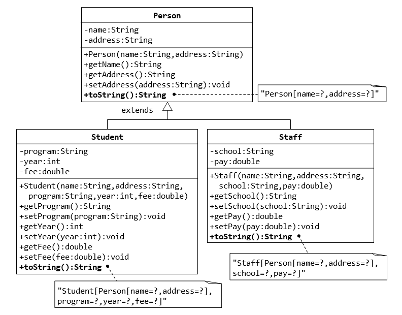
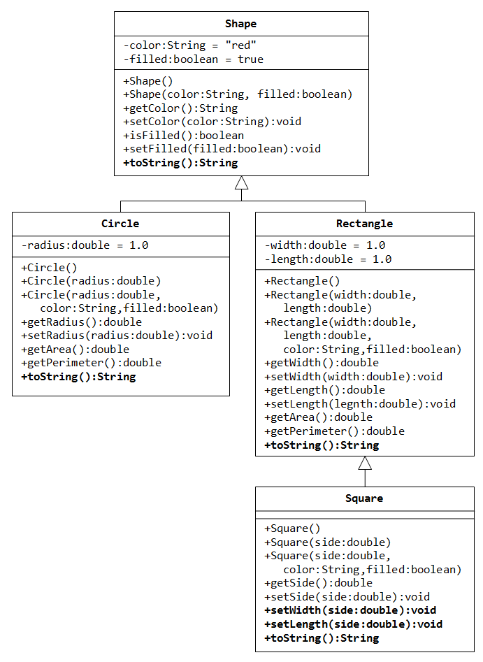

### Assignment 1

1. Write a brief history of Java Programming Language
2. Explain Primitive types in Java
3. What are the different programming constructs in java? Explain with examples.

---

### Assignment 2

Implement the body for the following function:


````java
static boolean isValidDate(int year, int month, int day) { 
	// do stuff here
	return false; 
}
````

The function should check if the parameter values constitute a valid calendar date or not. Accordingly return true or false.


For example,


1) year=2018, month=13, day=1 is an invalid date as the possible values for month is 1 to 12.
2) year=2018, month=2, day=29 is an invalid date as the maximum days in February is 28 in the year 2018
3) year=2016, month=2, day=29 is a valid date.

Write a Java program to call the above function multiple times with different values.


---

### Assignment 3

Implement the body for the following function:

````java
static boolean isPrimeNumber(int num) { 
	// do stuff here
	return false; 
}
````

The function should check and return true only if the number passed as argument is a prime number.
  
Write a Java program to call the above function multiple times with different values.


---

### Assignment 4

Write a function called "sortThreeNumbers", which takes 3 distinct integers and prints them in ascending order.

````java
public void sortThreeNumbers(int a, int b, int c) { 
	// do stuff here
}

````
For example,

* sortThreeNumbers(2, 10, 1); // prints 1, 2, 10 
* sortThreeNumbers(20, 10, 1); // prints 1, 10, 20 
* sortThreeNumbers(2, 10, 100); // prints 2, 10, 100 and so on.


Write a Java program to call the above function multiple times with different values.

---

### Assignment 5

Write a function called "sumOfPrimes", that takes two integers as input and returns the sum of all the prime numbers between the same.

````java
public int sumOfPrimes(int from, int to) { 
	// do stuff here
	return 0; 
}
````

Write a Java program to call the above function multiple times with different values.


---

### Assignment 6

In mathematics, the Fibonacci numbers are the numbers in the following integer sequence, characterized by the fact that every number after the first two numbers is the sum of the two preceding ones:

0, 1, 1, 2, 3, 5, 8, 13, 21, 34, 55, 89, 144, ...

Write a function called "fibonacci", that takes index as paramter and returns the fibonacci number at that index.

````java
public int fibonacci(int index) { 
	// do stuff here
	return 0; 
}
````

---

### Assignment 7

Write a Java program to print the following pattern:

````
*
**
***
****
*****
````

The number of rows should be based on the value of a variable "num", and the number of stars in a row is based on the row number itself.


---

### Assignment 8

In trignometry, the Sine of an angle is represented by the series below:


Write a Java function that accepts angle in degrees and returns the sine of the given angle.

Call the function in main, multiple times by supplying multiple values and verify the same.

PS:
* Divide the function into small reusable functions, if possible.
* Do not use builtin Java classes like `Math`
---


### Assignment 9


Implement the Java function listed below:

````java
public static void printCalendar(int month, int year) {
	/// do stuff here
}
````

The function should accept `month` and `year` and print the calendar for the same. If inputs are invalid, appropriate error message/s should be printed.

Sample output for the inputs (8, 2018):

````
Su Mo Tu We Th Fr Sa  
          1  2  3  4  
 5  6  7  8  9 10 11  
12 13 14 15 16 17 18  
19 20 21 22 23 24 25  
26 27 28 29 30 31  
````

PS: 
* Do not use any builtin Java classes like `Date` or `Calendar`
* Divide the function into small reusable functions, if possible.

---

### Assignment 10
Write a function called "sumOfEvensAndOdds", that takes an array of integers as input and returns another array of integers of length 2. The first element in the returned array is the sum of all even numbers in the input array, and the second element in the returned array is the sum of all odd numbers in the input array.

````java
public int[] sumOfEvensAndOdds(int []nums) { 
	// do stuff here
	return null;
}
````

For example,
 
````java
int [] nums = {1, 2, 3, 4, 5, 6, 7, 8, 9, 10}; 
int [] result = sumOfEvensAndOdds(nums);
// result should be equal to {30, 25}
````

Hint:

An arrays is created as shown below:

````java
int []arr = new int[2];
arr[0] = 12;
arr[1] = 100;
````

or

````java
int []arr = {12, 100}
````

Call the function in main, multiple times by supplying multiple values and verify the same.

---

### Assignment 11
Write a function called "reverseByWords", that takes a sentence (string) as an input, and returns another string. The return value must be a sentence in which the words in the original sentence appear in reverse order.

````java
public String reverseByWords(String sentence) { 
	// do stuff here
	return null; 
}
````


For example,

````java
String out = reverseByWords("my name is vinod and i live in bangalore");
// the variable "out" should be equal to "bangalore in live i and vinod is name my".
````

Call the function in main, multiple times by supplying multiple values and verify the same.

---
### Assignment 12


Write a function called "inWords" that takes a number between 1 and 99,99,99,999 and returns a String representing the input number in words.

````java
public String inWords(int num) { 
	// do stuff here
	return null; 
}

````
For example,

````java
inWords(12345);
// should return "twelve thousand three hundred forty five"
inWords(10203040);
// should return "one crore two lakh three thousand forty"
inWords(101);
// should return "one hundred one"
````


Call the function in main, multiple times by supplying multiple values and verify the same.

---
### Assignment 13

Implement the following function:

```java
public static void printAllCombinations(String word) {
	// do stuff here
}
```

The function should take a word (no spaces and special characters, only alpha numeric), and print all possible combinations of letters in the given word.

For example, for the input "win", the output should be:

```
[iwn, nwi, inw, wni, win, niw]
```

And for the input "vinod", the output should be:
```
[vidon, vonid, doniv, dovin, inodv, ivdon, vdnio, nivod, ovdin, ivodn, viodn, noidv, 
ondiv, dvoni, vidno, indvo, ivdno, nvodi, oindv, oivdn, idvon, dnovi, idnov, nvdoi, 
onidv, doinv, vndoi, voind, noivd, vdion, iovnd, ovidn, nvoid, idvno, ionvd, dvnoi, 
vnido, oidvn, vdoni, ndivo, vindo, novdi, idnvo, ndoiv, oidnv, dionv, vndio, iovdn, 
iondv, viond, ndvoi, odniv, odvin, diovn, nodiv, nviod, onvdi, vodni, invod, ovndi, 
vinod, dinov, vodin, divon, donvi, nvdio, ivnod, idonv, ovdni, dvion, nidov, ovnid, 
ondvi, niodv, idovn, ndvio, onvid, dvino, divno, vnoid, dnoiv, odivn, ndiov, vondi, 
nvido, dnivo, dinvo, dnvoi, odinv, dvoin, iodnv, nidvo, doivn, invdo, ovind, vdoin, 
iodvn, vnodi, oinvd, ndovi, vdino, ivndo, onivd, nivdo, oivnd, inovd, ivond, dnvio, 
odnvi, voidn, novid, dniov, dovni, vniod, nodvi, odvni, vdnoi, dvnio, indov, niovd]

```

Call the function in main, multiple times by supplying multiple values and verify the same.

---
### Assignment 14

Implement the following function:

```java
public static String generatePassword(int length) {
	// do stuff here
}
```

The function should return a random string, each time when called, of required length (function argument). The password consists of lower case and upper case alphabets, digits from 0 to 9, special characters `~!@#$%^&*`

Hint: 

`Math.random()` returns a number between 0.0 and 1.0


---
### Assignment 15

Create classes `Circle` and `Cylinder` as shown in the *UML* diagram below:


In the `main()` function of a Program class, create an array of `Circle` references with the initialization shown below:

````java
Circle[] circles = {
	new Cylinder(12.34),
	new Cylinder(12.34, 10.0),
	new Cylinder(12.34, 10.0, "blue")
};

````

Print the area of the circular region of each cylinder along with the volume of the same.


---
### Assignment 16

Create the classes `Person`, `Student`, and `Staff` as shown in the *UML* diagram below:




In the `main()` function of a Program class, create an array of `Person` references with the initialization shown below:

````java
Person[] people = {
	new Student("Shyam", "Bangalore, Karnataka", "Java fundamentals", 2010, 4500.0),
	new Staff("Anand", "Bangalore, Karnataka", "Delhi Public school", 35000.0), 
	new Staff("Umesh", "Bangalore, Karnataka", "National Public school", 42000.0), 
	new Student("Suresh", "Hassan, Karnataka", "Java fundamentals", 2012, 4750.0),
	new Student("Kiran", "Vasco, Goa", "Reactjs", 2017, 12500.0)
};

````

Print the details of all `Person` objects (using the `toString()`).


---

### Assignment 17

Create the classes `Shape`, `Circle`, `Rectangle`, and `Square` as shown in the *UML* diagram below:





The `toString` function of the above classes should return text as given below:

Classname|Sample return value from toString()
---|---
Shape|A Shape with color of xxx and filled/Not filled
Circle|A Circle with radius=xxx, which is a subclass of yyy (where yyy is the output of the toString() method from the superclass)
Rectangle|A Rectangle with width=xxx and length=zzz, which is a subclass of yyy (where yyy is the output of the toString() method from the superclass)
Square|A Square with side=xxx, which is a subclass of yyy (where yyy is the output of the toString() method from the superclass)

In the `main()` method of a Program class, create an array of 10 `Shape` references containing a mixture of `Circle`, `Rectangle` and `Square` objects of different dimensions. Using a loop, print the `perimeter` and `area` for all of them.


---

### Assignment 18

Write a Java application to accept integers in a loop. After each number is accepted, the user should be asked if he/she wishes to continue. If the user inputs "NO", then the loop should be stopped and following output should be displayed:

```
Number of inputs = X
Number of integer inputs = Y
Number of non-integer inputs = Z
Sum of all integer inputs = XX
The integer inputs = N1, N2, N3, ...
The non-integer inputs = ASD, SDF, DFG, ...
X, Y, Z, etc should be actual values, based on the inputs.
```

HINT: 

Use `java.util.Scanner` for accepting data from the user. 

```java
Scanner s = new Scanner(System.in);
String input = s.nextLine();
int n = s.nextInt();
double d = s.nextDouble();
// ... s
```

---

### Assignment 19

Write a function called "calendar" that takes a String representing year/month in YYYY-MM format and returns a two-dimensional array representing the calendar for the input month and year.


For example, if the input is "2018-03”, then the output is:

```
{
	{0, 0, 0, 0, 1, 2, 3},
	{4, 5, 6, 7, 8, 9, 10},
	{11, 12, 13, 14, 15, 16, 17}, 
	{18, 19, 20, 21, 22, 23, 24}, 
	{25, 26, 27, 28, 29, 30, 31}
}
```

For input "2018-02", the output should be:

```
{
	{0, 0, 0, 0, 1, 2, 3},
	{4, 5, 6, 7, 8, 9 10},
	{11, 12, 13, 14, 15, 16, 17}, 
	{18, 19, 20, 21, 22, 23, 24}, 
	{25, 26, 27, 28, 0, 0, 0}
}
```
The method should throw a custom exception **InvalidDateException**, in case if the input does not represent a valid year/month combination, and **InvalidInputException** in case if the input is not in the expected YYYY-MM format.


---

### Assignment 20

Create a menu driven application to manage product catalog. When the application is run, it should display the following menu options:

1. List all products
1. Search a product by id
1. Search products by name
1. Search products by price range
1. List out-of-stock products
1. List products that are no longer sold
1. Add a new product
1. Edit product details
1. Exit


### 1. Lsit all products

Should display the id, name, quantity-per-unit and the unit-price of all the products (that are not discontinued)

### 2. Search a product by id

Should accept a product-id from the user and display all the details about that product, if exists. If there are no products for the given id, an appropriate error should be displayed.

### 3. Search products by name

Should accept a text from the user and list out all the products (id, name, quantity-per-unit and the unit-price) that match the input text (even partially).

### 4. Search products by price range

Should accept two numbers (minimum and maximum prices), and list out all the products (id, name, quantity-per-unit and the unit-price)  that belong to the given price range.

### 5. List out-of-stock products

Should display all the products (id, name, quantity-per-unit and the unit-price) which have 0 as the value for units-in-stock field of the product object.

### 6. List products that are no longer sold

Should display all the products (id, name, quantity-per-unit and the unit-price) which have 1 as the value for discontinued field of the product object.

### 7. Add a new product

Should accept all the details of the product and should be added to the underlying repository (array or collection or csv-file or serialized-file or database table). The value for id field should be auto generated.

### 8. Edit product details

Should display the details of the product (except id) and should accept new values for each of the fields from the user. If the user simply presses ENTER key, the value for that field should not be changed.

### 9. Exit

Should exit the app.

Any other inputs apart from the above should result in an error message and re-display the menu. After each of the above operation is performed, the menu is re-displayed.

Whenever an input is expected from the user, handle the erroneous inputs appropriately.

## Classes required for the application:

1. Product.java

```java
package com.publicissapient.training.entity;

// imports here

@NoArgsConstructor
@Setter
@Getter
public class Product {
	private Integer productId;
	private String productName;
	private String quantityPerUnit;
	private Double unitPrice;
	private Integer unitsInStock;
	private Integer unitsOnOrder;
	private Integer reorderLevel;
	private Boolean discontinued;

}
```

## ProductDao.java

```java
package com.ps.assignment20.dao;

// imports here

public interface ProductDao {

	public List<Product> getAllProducts() throws DaoException;

	public Product getProduct(int productId) throws DaoException;

	public List<Product> getProductsByName(String name) throws DaoException;

	public List<Product> getAllProductsByPrice(double min, double max) throws DaoException;

	public List<Product> getOutOfStockProducts() throws DaoException;

	public List<Product> getDiscontinuedProducts() throws DaoException;

	public void addNewProduct() throws DaoException;

	public void updateProduct(Product product) throws DaoException;
}
```

Othere related classes are:

1. App.java --> contains the code for displaying menu, accepting data from keyboard etc
2. DaoException.java --> custom checked exception 
3. KeyboardUtil.java --> public static functions to accept data from the keyboard
	1. getInt(message)
	1. getString(message)
	1. getDouble(message)
	1. etc.

