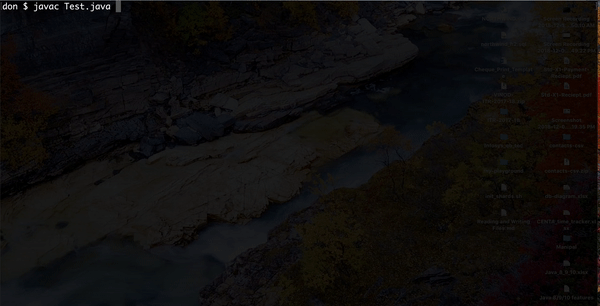
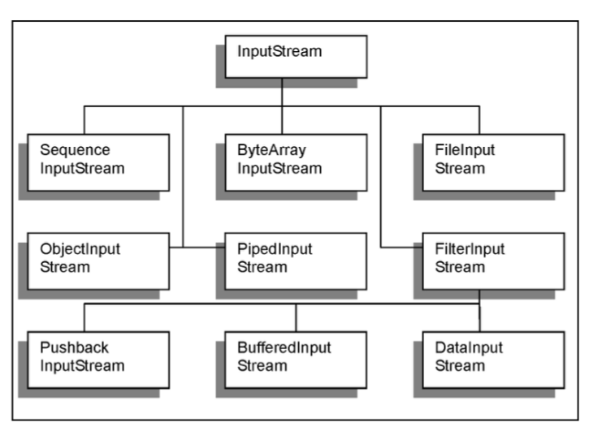
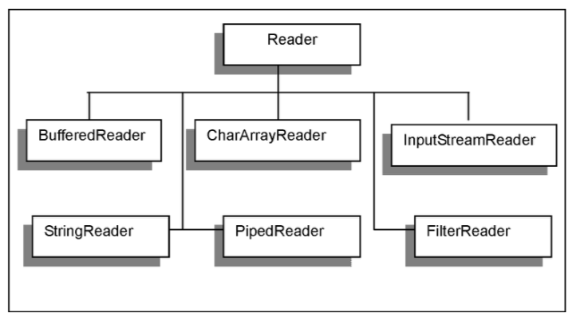
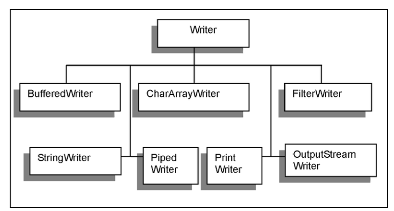

# Core Java and Data Structures Training

<div id="toc">

## Table of content

* <a href="#history_of_java">History of Java</a>
* <a href="#getting_started_with_java_language">Getting started with Java language</a>
* <a href="#variables_and_datatypes">Variables and datatypes</a>
* <a href="#operators">Operators</a>
* <a href="#if_else_construct">if-else construct</a>
* <a href="#switch_case_construct">switch-case construct</a>
* <a href="#the_while_loop">The *while* loop</a>
* <a href="#the_for_loop">The *for* loop</a>
* <a href="#the_do_while_loop">The *do-while* loop</a>
* <a href="#transfer_statements">Transfer statments</a>
* <a href="#defining_and_">Defining and initializing arrays</a>
* <a href="#the_string_class">The *String* class</a>
* <a href="#overview_of_inheritance_and_is_a_relationship">Overview of inheritance and IS-A relationship</a>
* <a href="#use_of_packages">Use of packages</a>
* <a href="#interfaces_in_java">Interfaces in Java</a>
* <a href="#error_handling_and_java_exception_api">Error handling and Java exception API</a>
* <a href="#io_streams_in_java">IO streams in Java</a>
</div>


<div id="history_of_java">

### History of Java

Oak was developed by the members of the Green Project, which included Patrick Naughton, Mike Sheridan and James Gosling, a group formed in 1991 to create products for the smart electronics market. The team decided that the existing programming languages were not well suited for use in consumer electronics. 

The chief programmer of Sun Microsystems, James Gosling, was given the task of creating the software for controlling consumer electronic devices. The team wanted a fundamentally new way of computing, based on the power of networks, and wanted the same software to run on different kinds of computer, consumer gadgets and other devices. Patenting issues gave a new name to Oak – Java.

During that period, Mosaic, the first graphical browser, was released. Non-programmers started accessing the World Wide Web and the Web grew dramatically. People with different types of machines and operating systems started accessing the applications available on the web. Members of the Oak team realized that Java would provide the required cross-platform independence that is, independence from the hardware, the network, and the operating system. Very soon, Java became an integral part of the web.

Java works just everywhere, from the smallest devices to supercomputer. Java technology components (programs) do not depend on the kind of computer, telephone, television, or operating system they run on. They work on any kind of compatible device that supports the Java platform.
</div>


<div id="getting_started_with_java_language">

<a href="#toc">[TOC]</a> 

### Getting started with Java language

#### Java Development Kit (JDK)

A Java software development kit (SDK or "devkit") is a set of development tools that is used in developing applications for  certain software package, software framework, hardware platform, computer system, video game console, operating system, or similar platform. If J2SE 1.2 is used to develop applications, then you are using the platform what's known as the Java 2 Platform. The latest Java 5 or J2SE 1.5 is Sun’s latest version that has several enhancements to the Java language.

There are several programming tools and packages in JDK which includes the Java programming language core functionality, the Java Application Programming Interface (API) with multiple package sets, and essential tools for developing Java programs.

The packages available in JDK are: **java.applet, java.awt, java.awt.image, java.awt.peer, java.io, java.lang, java.net, and java.util**.  These packages provide everything that needs to start creating powerful Java applications. The JDK also includes an additional package called sun.tools.debug, which is designed to make the application-debugging process easier.

Programming Tools available in current version of JDK are used to create Java bytecode, view programs, debug code and used for security purpose. Tools available in current version of JDK are given in table given below. 


Table : Tools in JDK

| Executable| Tool Name| Description|
|---|---|---|
| Appletviewer| The Java applet viewer| Used to view applets without a Web browser|
| Java| The Java interpreter| Runs Java bytecode|
| Javac| The Java compiler| Compiles Java programs into bytecode|
| Javadoc| The Java API documentation generator| Creates API documentation in HTML format from Java source code|
| Javah| The Java header and stub file generator| Creates C-language header and stub files from a Java class, which allows the Java and C code to interact|
| Javap| The Java class file disassemble| Disassembles Java files and prints out a representation of Java bytecode|
| Jdb| The Java language debugger| Helps to find and fix problems in Java code|

There are some advanced commands also for debugging the programs that is available in JDK.  

They are:

* **up** – moves up the stack frame so that locals and print can be used to examine the program at the point before the current method was called.
* **down** – moves down the stack frame to examine the program after the method call.
Following commands can also be used while debugging:
* **classes** – lists the classes currently loaded into memory
* **methods** – lists the methods of a class
* **memory** – lists the total memory and the amount that is not currently in use
* **threads** – lists the threads that are executing
* **suspend** thread – suspends threads (by default all are suspended)
* **resume** thread – resume threads (by default all)
* **where** – dumps a thread’s stack
* **threadgroups** – lists the threadgroups
* **print** – prints an object
* **locals** – print all local variables in current stack frame
* **dump** – print all object information
* **cont** – continue execution from breakpoint
* **catch** <class id> - break for the specified exception
* **ignore** <class id> - ignore when the specified exception
* **gc** – free unused objects
* **load** classname – load Java class to be debugged
* **run** <class> [args] – start execution of a loaded Java class
* **!! –** repeat last command
* **help** (or ?) – list commands
* **exit** (or quit) – exit debugger

Along with the programming tools mentioned above there are three tools used for security purpose in the JDK. They are Keytool, Jar and Jarsigner.

1) Keytool
Keytool, the Java security key tool, is used to create and manage public keys, private keys and security certificates.  It can be used to do the following:

* Manages the own public key / private key pairs.
* Stores the public keys of people and groups which communicates with.
* Uses the certificates associated with these keys to authenticate the user to others.
* Authenticate the source and integrity of data.

2) The jar Archival Tool and jarsigner

The Java archival tool jar is used to package into a single archive file a Java program and all resource files that it requires.

The advantage of jar tool is to speed up the loading time for an applet on the web, especially when the applet needs a group of other files in order to function.  Jar is also necessary to create a digitally signed Java program.  All class files which are needed to run a particular Java program need to be packaged into an archive jar file before being signed. When a jar file is included in the program it should be signed using a jarsigner.  The following two activities should be performed:

* Digitally signing a java archive file
* Verifying the digital signature and contents of a java archive

To digitally sign a java archive file, following have to be specified i.e. a name of the jar archive and the name of the private key to sign it with. The jarsigner tool has several command-line options that are identical to those offered by keytool, including –keystore, which is used to specify the folder and the file location of a key store.

The jar tool also can be used to verify a digitally signed archive by adding the –verify option to the command.  If the private key matches the Java archive and the archive’s contents did not change after it was signed, it will be verified by the jarsigner.

#### Working of Java

A compiler converts the Java program into an intermediate language representation called bytecode which is platform independent. A Java file will have the extension .java, similar to a word file having the extension .doc, a Pascal file having the extension .pas and a text file having the extension .txt.

Let us assume that there exists a Java file named **Hello.java**. When this file is complied we get a file called as **Hello.class**.

This class file is run using an interpreter as and when necessary. 

**Helo.java**:

```java
public class Hello {
    public static void main(String[] args) {
        System.out.println("Hello, friend!");
    }
}
```

Watch the following video for the steps to compile and execute the code:


The concept of "write once, run anywhere" is possible in Java. The Java program can be compiled on any platform having a Java compiler. The resulting bytecode can then be run on Windows or Solaris or Macintosh or any other machine. The machine should have a Java platform to run Java code. Java platform consists of Java Virtual Machine (JVM) and a package of ready made software components. This package is known as Java Application Programming Interface (Java API). The compiled Java program can run on any hardware platform having Java Virtual Machine (JVM) installed on it.


</div>


<div id="variables_and_datatypes">

<a href="#toc">[TOC]</a> 

### Variables and datatypes

### Data Types in Java

#### Primitive Data Types

Primitive data types (also know as standard data types) are the data types that are built into the Java language. The Java compiler holds detailed instructions on each legal operation the data type supports. There are eight primitive data types in Java (see Table).

Table: Primitive / Standard Data Types

|Data Type|Size/Format (bits)|Description|Range|
|---|---|---|---|
|byte|8|Byte-length integer|-128 to 128 (signed)|0 to 255 (unsigned)|
|short|16|Short integer|-215 to 215 -1 |
|int|32|Integer|-231 to 231 -1|
|long|64|Long integer|-263 to 263 -1|
|float|32|Single precision floating point|+/- about 1039|
|double|64|Double precision floating point|+/- about 10317|
|char|16|A single character|Any single character|
|boolean|1|A boolean value |true or false|

The data types – byte, short, int, long, float and double are numeric data types. The first four of these can hold only whole numbers whereas the last two (float and double) can hold decimal values like 5.05. All these data types can hold negative values. However, the keyword unsigned can be used to restrict the range of values to positive numbers. Amongst others, boolean can hold only the value true or false and char can hold only a single character.|

#### Abstract / Derived Data Types

Abstract data types are based on primitive data types and have more functionality than the primitive data types. For example, String is an abstract data type that can store alphabets, digits and other special characters like /, (); :$#. You cannot perform calculations on a variable of the String data type even if the data stored in it has digits.

### Variables in Java

When you learned algebraic equations in school, you used x and y to represent values in equations. Unlike pi which has a constant value of 3.14, the values of x and y are not constant in equations. Java provides constants and variables to store data in programs.

Java allocates memory to each variable and constant you use in your program. As in algebra, the values of variables may change in a program, but the values of constants, as the name suggests, do not change. You must assign unique names to variables and constants. Variable names are used in a program in much the same way as they are in ordinary algebra.

Each variable used in a program must be declared. That is to say, the program must contain a statement specifying precisely what kind of information (data type) the variable will contain. This applies to every variable used in the program, regardless of the type.

#### Naming Variables

A program refers to a variable using its name. Certain rules and conventions govern the naming of variables. You must adhere to rules. Conventions help improve the readability of the program, but following them is not mandatory.

#### Rules for Naming Variables in Java

A variable name: 

* Must not be a keyword in Java.
* Must not begin with a digit.
* Must not contain embedded spaces.
* Can contain characters from various alphabets, like Japanese, Greek, and Cyrillic.

#### Syntax for Defining Variables

All the attributes of a class are defined as data members. The syntax used to declare a class variable is:

<data_type> <variable_name>;

As the brackets “{ }” are used to mark the beginning and end of a class, a semicolon “;” is used to mark the end of a statement.

</div>


<div id="operators">
<a href="#toc">[TOC]</a> 

### Operators

Operators play an important role in Java.  There are three kinds of operators in Java. They are 

1. Arithmetic Operators 
2. Comparison / Relational Operators and 
3. Logical Operators

#### Arithmetic Operators

Addition, Subtraction, Multiplication, Division and Modulus are the various arithmetic operations that can be performed in Java.

List of Arithmetic Operators: 

|Operator|Meaning|Use|Meaning|
|---|---|---|---|
|+|Addition|op1+op2|Adds op1 and op2|
|-|Subtraction|op1-op2|Subtracts op2 from op1|
|*|Multiplication|op1*op2|Multiplies op1 and op2|
|/|Division|op1/op2|Divides op1 by op2|
|%|Modulus|op1 % op2|Computes the remainder of dividing op1 by op2|

The following Java program adds two numbers and prints the result.

Java Program to add two numbers and printing the result: 

```java
public class Test {
    public static void main(String[] args) {
        int a = 123;
        int b = 234;
        int c;

        c = a + b;
        System.out.println("The sum of " + a + " and " + b + " is " + c);
    }
}
```

The compilation and running of the program is shown in the following figure:



#### Increment and Decrement Operators

The increment operator is ++ and decrement operator is --. This is used to add 1 to the value of a variable or subtract 1 from the value of a variable. These operators are placed either before the variable or after the variable name. The example below shows the use of these operators.

Example showing increment operators in Java: 

```java
public class Test2 {
    public static void main(String[] args) {
        int a = 12;
        int b = 23;

        int a1, b1;
        a1 = a++;
        b1 = ++b;

        System.out.println("a = " + a + ", a1 = " + a1);
        System.out.println("b = " + b + ", b1 = " + b1);
    }
}
```

Program Compilation and Running: 


When the operator ++ is placed after the variable name, first the assignment of the value of the variable takes place and then the value of the variable is incremented. This operation is also called post increment. Therefore the value of y1 will remain as 5 and the value of x1 will be 6. When the operator is placed before the variable, first increment of the variable takes place and then the assignment occurs. Hence the value x2 and y2 both will be 6. This operation is also called as pre increment. Similarly – – operator can be used to perform post decrement and pre decrement operations. If there is no assignment and only the value of variable has to be incremented or decremented then placing the operator after or before does not make difference.

#### Comparison Operators

Comparison operators are used to compare two values and give the results.

List of Comparison Operators in Java:

|Operator|Meaning|Example|Remarks|
|---|---|---|---|
|==|Equal|op1 == op2|Checks if op1 is equal to op2|
|!=|Not Equal|op1 != op2|Checks if op1 is not equal to op2|
|<|Less than|op1 < op2|Checks if op1 is less than op2|
|>|Greater than|op1 > op2|Checks if op1 is greater than op2|
|<=|Less than or equal|op1 <= op2|Checks if op1 is less than or equal to op2|
|>= |Greater than or equal|op1 >= op2|Checks if op1 is greater than or equal to op2|

#### Logical Operators

Logical operators are used to perform Boolean operations on the operands.

List of Logical Operators in Java: 

|Operator|Meaning|Example|Remarks|
|---|---|---|---|
|&&|Short-circuit AND|op1 && op2|Returns true if both are true.  If op1 is false, op2 will not be evaluated and returns false.|
||||Short-circuit OR|op1 || op2|Returns true if anyone is true.  If op1 is true, op2 will not be evaluated and returns true.|
|!|Logical unary NOT|!op|Returns true if op is false.|
|&|Logical AND|Op1 & op2|Returns true if both are true.  Always op1 and op2 will be evaluated.|
|||Logical OR|Op1 | op2|Returns true if anyone is true.  Always op1 and op2 will be evaluated.|


#### Operator Precedence

When more than one operator is used in an expression, Java will use operator precedence rule to determine the order in which the operators will be evaluated. For example, consider the following expression:

Result=10+5*8-15/5

In the above expression, multiplication and division operations have higher priority over the addition and subtraction. Hence they are performed first.  Now, Result = 10+40-3.

Addition and subtraction has the same priority. When the operators are having the same priority, they are evaluated from left to right in the order they appear in the expression. Hence the value of the result will become 47. In general the following priority order is followed when evaluating an expression:

* Increment and decrement operations.
* Arithmetic operations.
* Comparisons.
* Logical operations.
* Assignment operations.
To change the order in which expressions are evaluated, parentheses are placed around the expressions that are to be evaluated first. When the parentheses are nested together, the expressions in the innermost parentheses are evaluated first. Parentheses also improve the readability of the expressions. When the operator precedence is not clear, parentheses can be used to avoid any confusion.

</div>

<div id="if_else_construct">
<a href="#toc">[TOC]</a> 

### if-else construct

The if statement is Java's conditional branch statement. It can be used to route program execution through two different paths.

Here is the general syntax of the if statement:

```java
if (condition) statement1;
else statement2;
```

Here, each statement may be a single statement or a compound statement enclosed in curly brackets { }(that is, a block). The condition is any expression that returns a boolean value. The else clause is optional.

The if statement works like this: If the condition is true, then statement1 is executed. Otherwise, statement2 (if it exists) is executed. In no case will both statements be executed.


If… else statement example:

```java
// This program checks if the student has passed or failed

public class Result {
    public static void main(String[] args) {
        int marks = 45;

        if(marks <35) {
            System.out.println("The student has failed!");
        }
        else {
            System.out.println("The student has passed!");
        }
    }
}
```

Compilation and execution of the above code:


Most often, the expression used to control the if will involve the relational operators. However, this is not technically necessary. It is possible to control the if using a single boolean variable, as shown in this code fragment:

```java
boolean dataAvailable; 
// ...
if (dataAvailable)
    ProcessData();
else
    waitForMoreData();
```

Remember, only one statement can appear directly after the if or the else. If you want to include more statements, you'll need to create a block, as in this fragment:

```java
int bytesAvailable;
// ...
if (bytesAvailable > 0) {
    ProcessData();
    bytesAvailable -= n;
} else
    waitForMoreData();
```
Here, both statements within the if block will execute if bytesAvailable is greater than zero. Some programmers find it convenient to include the curly braces when using the if, even when there is only one statement in each clause. This makes it easy to add another statement at a later date, and you don't have to worry about forgetting the brackets. In fact, forgetting to define a block when one is needed is a common cause of errors. For example, consider the following code fragment:

```java
int bytesAvailable;
// ...
if (bytesAvailable > 0) {
    ProcessData();
    bytesAvailable -= n;
} else
    waitForMoreData();
bytesAvailable = n;
```

It seems clear that the statement bytesAvailable = n; was intended to be executed inside the else clause, because of the indentation level. However, as you recall, whitespace is insignificant to Java, and there is no way for the compiler to know what was intended. This code will compile without complaint, but it will behave incorrectly when run.

The preceding example is fixed in the code that follows:

```java
int bytesAvailable;
// ...
if (bytesAvailable > 0) {
    ProcessData();
    bytesAvailable -= n;
} else {
    waitForMoreData();
    bytesAvailable = n;
}
```

#### The if-else-if Ladder

A common programming construct that is based upon a sequence of nested if is the if-else-if ladder. It looks like this:


```java
if(condition)
    statement;
else if(condition)
    statement;
else if(condition)
    statement;
.
.
.
else
    statement;
```

The if statements are executed from the top down. As soon as one of the conditions controlling the if is true, the statement associated with that if is executed, and the rest of the ladder is bypassed. If none of the conditions is true, then the final else statement will be executed. The final else acts as a default condition; that is, if all other conditional tests fail, then the last else statement is performed. If there is no final else and all other conditions are false, then no action will take place.

Here is a program that uses an if-else-if ladder to determine which season a particular month is in.

```java
// Demonstrate if-else-if statements.

class IfElse {
    public static void main(String args[ ]) {
        int month = 4; // April
        String season;

        if(month == 12 || month == 1 || month == 2)
            season = "Winter";
        else if(month == 3 || month == 4 || month == 5)
            season = "Spring";
        else if(month == 6 || month == 7 || month == 8)
            season = "Summer";
        else if(month == 9 || month == 10 || month == 11)
            season = "Autumn";
        else
            season = "Bogus Month";

        System.out.println("April is in the " + season + ".");
    }
}
```
Here is the output produced by the program:


You might want to experiment with this program before moving on. As you will find, no matter what value you give month, one and only one assignment statement within the ladder will be executed.

</div>

<div id="switch_case_construct">
<a href="#toc">[TOC]</a> 

### switch-case construct

The switch statement is Java's multi-way branch statement. It provides an easy way to dispatch execution to different parts of your code based on the value of an expression.

Switch Statement

As such, it often provides a better alternative than a large series of if-else-if statements.

Here is the general form of a switch statement:

```java
switch (expression) {
	case value1:
		// statement sequence
		break;
	case value2:
		// statement sequence
		break;
	.
	.
	.
	case valueN:
		// statement sequence
		break;
	default:
		// default statement sequence
}
```

The expression must be of type byte, short, int, or char; each of the values specified in the case statements must be of a type compatible with the expression. Each case value must be a unique literal (that is, it must be a constant, not a variable). Duplicate case values are not allowed.

The switch statement works as follows: The value of the expression is compared with each of the literal values in the case statements. If a match is found, the code sequence following that case statement is executed. If none of the constants matches the value of the expression, then the default statement is executed. However, the default statement is optional. If no case matches and no default is present, then no further action is taken.

The break statement is used inside the switch to terminate a statement sequence. When a break statement is encountered, execution branches to the first line of code that follows the entire switch statement. This has the effect of "jumping out" of the switch. 

The switch…case statement example: 

```java
public class SwitchCase {
	public static void main(String[] args) {
		int weekDay = 3;

		switch(weekDay) {
			case 1:
				System.out.println("Sunday"); 
				break;
			case 1:
				System.out.println("Monday"); 
				break;
			case 1:
				System.out.println("Tuesday"); 
				break;
			case 1:
				System.out.println("Wednessday"); 
				break;
			case 1:
				System.out.println("Thursday"); 
				break;
			case 1:
				System.out.println("Friday"); 
				break;
			case 1:
				System.out.println("Saturday"); 
				break;
			default:
				System.out.println("Not a valid day!"); 
		}
	}
}
```

The break statement is optional. If you omit the break, execution will continue on into the next case. It is sometimes desirable to have multiple cases without break statements between them. For example, consider the following program:

```java
// In a switch, break statements are optional.
class MissingBreak {
	public static void main(String args[ ]) {
		for(int i=0; i<12; i++) {
			switch(i) {
				case 0:
				case 1:
				case 2:
				case 3:
				case 4:
					System.out.println("i is less than 5");
					break;
				case 5:
				case 6:
				case 7:
				case 8:
				case 9:
					System.out.println("i is less than 10");
					break;
				default:
					System.out.println("i is 10 or more");
			}
		}
	}
}
```

Output of the above program: 


#### Nested switch Statements

You can use a switch as part of the statement sequence of an outer switch. This is called a nested switch. Since a switch statement defines its own block, no conflicts arise between the case constants in the inner switch and those in the outer switch. For example, the following fragment is perfectly valid:

```java
switch(count) {
	case 1:
		switch(target) { // nested switch
			case 0:
				System.out.println("target is zero");
				break;
			case 1: // no conflicts with outer switch
				System.out.println("target is one");
				break;
		}
		break;
	case 2: // ...
...
```

Here, the case 1: statement in the inner switch does not conflict with the case 1: statement in the outer switch. The count variable is only compared with the list of cases at the outer level. If count is 1, then target is compared with the inner list cases.

In summary, there are three important features of the switch statement to note:

* The switch differs from the if in that switch can only test for equality, whereas if can evaluate any type of Boolean expression. That is, the switch looks only for a match between the value of the expression and one of its case constants.
* No two case constants in the same switch can have identical values. Of course, a switch statement enclosed by an outer switch can have case constants in common.
* A switch statement is usually more efficient than a set of nested ifs.

The last point is particularly interesting because it gives insight into how the Java compiler works. When it compiles a switch statement, the Java compiler will inspect each of the case constants and create a "jump table" that it will use for selecting the path of execution depending on the value of the expression. Therefore, if you need to select among a large group of values, a switch statement will run much faster than the equivalent logic coded using a sequence of if-else. The compiler can do this because it knows that the case constants are all the same type and simply must be compared for equality with the switch expression. The compiler has no such knowledge of a long list of if expressions.

</div>

<div id="the_while_loop">
<a href="#toc">[TOC]</a> 

### The *while* loop

The while loop is Java's most fundamental looping statement. It repeats a statement or block while its controlling expression is true.

Here is its general form:

```java
while (condition) {
	// body of loop
}
```

The condition can be any Boolean expression. The body of the loop will be executed as long as the conditional expression is true. When condition becomes false, control passes to the next line of code immediately following the loop. The flower brackets are unnecessary if only a single statement is being repeated.

While loop example:

```java
public class Factorial {
	public static void main(String[] args) {
		int n = 5;
		int fact = 1;
		int i = 1;

		while(i<=n) {
			fact *= i;
			i++;
		}

		System.out.println("Factorial of " + n + " is " + fact);
	}
}
```

Output: 


Here are the key takeaways:
* The while loop uses a condition that can be any Boolean expression.
* The flower brackets are unnecessary if only a single statement is being repeated.


</div>

<div id="the_for_loop">
<a href="#toc">[TOC]</a> 

### The *for* loop

Use the for loop when the number of iterations is fixed or known in advance

The usage of for loop is as follows:

```java
for (initial statement; termination condition; increment instruction)
	statement;
```

When multiple statements are to be included in the for loop, the statements are included inside flower braces as below:

```java
for (initial statement; termination condition; increment instruction) {
	Statement 1;
	statement 2;
}
```

The example below prints numbers from 1 to 10.

```java
public class ForLoopExample {
	public static void main(String[] args) {
		for(int i=1; i<=10; i++) {
			System.out.println(i);
		}
	}
}
```

The result of the above program is shown below:


Like all other programming languages, Java allows loops to be nested. That is, one loop may be inside another. For example, here is a program that nests for loops:


```java
// Loops may be nested.
public class NestedForLoopExample {
	public static void main(String args[ ]) {
		int i, j;
		for(i=0; i<10; i++) {
			for(j=i; j<10; j++)
				System.out.print("*");
			System.out.println();
		}
	}
}
```

The output produced by this program is shown here:


Here are the key takeaways:
* When multiple statements are to be included in the for loop, the statements are included inside flower


</div>

<div id="the_do_while_loop">
<a href="#toc">[TOC]</a> 

### The *do-while* loop

If the conditional expression controlling a while loop is initially false, then the body of the loop will not be executed at all. However, sometimes it is desirable to execute the body of a while loop at least once, even if the conditional expression is false to begin with. In other words, there are times when you would like to test the termination expression at the end of the loop rather than at the beginning. Fortunately, Java supplies a loop that does just that: the do-while.

The do-while loop always executes its body at least once, because its conditional expression is at the bottom of the loop. Its general form is

```java
do {
	// body of loop
} while (condition);
```

Each iteration of the do-while loop first executes the body of the loop and then evaluates the conditional expression. If this expression is true, the loop will repeat. Otherwise, the loop terminates. As with all of Java's loops, condition must be a boolean expression.

Do-while loop example:

```java
public class DoWhileExample {
    public static void main(String[] args) {
        int n = 5;
        int fact = 1;
        int i = 1;

        do {
            fact *= i;
            i++;
        } while(i<=n);

        System.out.println("Factorial of " + n + " is " + fact);
    }
}
```

Output: 


The do-while loop is especially useful when you process a menu selection, because you will usually want the body of a menu loop to execute at least once. Consider the following program which implements a very simple help system for Java's selection and iteration statements:

```java
// Using a do-while to process a menu selection
import java.util.Scanner;

public class DoWhileMenuExample {
    public static void main(String args[]) {

        int choice;

        do {
            Scanner sc = new Scanner(System.in);

            System.out.println("Help on:");
            System.out.println("1. if");
            System.out.println("2. switch");
            System.out.println("3. while");
            System.out.println("4. do-while");
            System.out.println("5. for\n");
            System.out.println("Choose one:");

            choice = sc.nextInt();

            if(choice < 1 || choice > 5) {
                System.out.println("Invalid choice, please retry!\n\n");
            }

        } while( choice < 1 || choice > 5);

        System.out.println("\n");

        switch(choice) {
            case 1:
                System.out.println("The if:\n");
                System.out.println("if(condition) statement;");
                System.out.println("else statement;");
                break;
            case 2:
                System.out.println("The switch:\n");
                System.out.println("switch(expression) {");
                System.out.println("\tcase constant:");
                System.out.println("\tstatement sequence");
                System.out.println("\tbreak;");
                System.out.println("\t// ...");
                System.out.println("}");
                break;
            case 3:
                System.out.println("The while:\n");
                System.out.println("while(condition) statement;");
                break;
            case 4:
                System.out.println("The do-while:\n");
                System.out.println("do {");
                System.out.println("\tstatement;");
                System.out.println("} while (condition);");
                break;
            case 5:
                System.out.println("The for:\n");
                System.out.print("for(init; condition; iteration)");
                System.out.println("\tstatement;");
        }
    } 
}
```

Output:


Here are the key takeaways:
* The do-while loops is a post-checked while loop
* The do-while loop is especially useful when you process a menu selection, because you will usually want the body of a menu loop to execute at least once.


</div>

<div id="transfer_statements">
<a href="#toc">[TOC]</a> 

### Transfer statments

Java allows us to use break and continue statements to transfer control from a loop or switch (break only) constructs

#### The `break` Statement

By using break, you can force immediate termination of a loop, bypassing the conditional expression and any remaining code in the body of the loop. When a break statement is encountered inside a loop, the loop is terminated and program control resumes at the next statement following the loop. Here is a simple example:

```java
// Using break to exit a loop
public class BreakLoop {
    public static void main(String args[ ]) {
        for(int i=0; i<100; i++) {
            if(i == 10) break; // terminate loop if i is 10
            System.out.println("i: " + i);
        }
        System.out.println("Loop complete.");
    }
}
```

This program generates the following output:


As you can see, although the for loop is designed to run from 0 to 99, the break statement causes it to terminate early, when i equal 10.

#### The `continue` Statement

Sometimes it is useful to force an early iteration of a loop. That is, you might want to continue running the loop, but stop processing the remainder of the code in its body for this particular iteration. The continue statement performs such an action. In while and do-while loops, a continue statement causes control to be transferred directly to the conditional expression that controls the loop. In a for loop, control goes first to the iteration portion of the for statement and then to the conditional expression. For all three loops, any intermediate code is bypassed.

Here is an example program that uses continue to cause two numbers to be printed on each line:

```java
// Demonstrate continue.
public class ContinueLoop {
    public static void main (String args[ ]) {
        for (int i=0; i<10; i++) {
            System.out.print (i + " ");
            if (i%2 == 0) continue;
            System.out.println ("");
        }
    }
}
```

This code uses the % operator to check if i is even. If it is, the loop continues without printing a newline. 

Here is the output from this program:


As with the break statement, continue may specify a label to describe which enclosing loops to continue. 

Here are the key takeaways:
* the break statement can take the control away from any loop or switch-case constructs
* the continue statement is used for skipping the remaining parts of the loop and to start a fresh iteration


</div>

<div id="defining_and_">
<a href="#toc">[TOC]</a> 

### Defining and initializing arrays

An array in Java represents a number of variables which occupy contiguous spaces in the memory. Each element in the array is distinguished by its index.

All elements in an array must be of the same data type. For example, you cannot have one element with int data type and another belonging to the boolean data type in the same array. An array is a collection of elements of the same type that are referenced by a common name. Each element of an array can be referred to by an array name and a subscript or index. To create and use an array in Java, you need to first declare the array and then initialize it. 

#### One-dimensional arrays

A one-dimensional array is a list of like-typed variables. 

The general form of a one dimensional array declaration is:

```java
type var-name [ ];
```

Here, type declares the base type of the array and determines the data type of each element that makes the array. Hence the base type determines the type of data the array will hold. For example, int numbers[ ]; declares an array named numbers with the type “array of int”:

This declaration says the numbers is an array variable but no array actually exists because the value of numbers is set to null, which represents an array with no value. To link numbers with an actual, physical array of integers, you must allocate one using new (which is a special operator to allocate memory) and assign it to numbers. Here new is used to allocate memory for arrays. The general form of new as it applies to one-dimensional arrays is as follows:

```java
array-var = new type[size];
```

Here, type specifies the type of data being allocated, size specifies the number of elements in the array, and array-var is the array variable that is linked to the array. That is, to use new to allocate an array, you must specify the type and number of elements to allocate. The elements in the array allocated by new will automatically be initialized to zero.

For example, `numbers = new int[10];` allocates a 10-element array of integers and links them to numbers.

Note that in Java all arrays are dynamically allocated. 

For example, `numbers[1] = 23;` assigns the value 23 to the second element of numbers.

#### Multidimensional arrays

In Java, multidimensional arrays are actually arrays of arrays. To declare a multidimensional array variable, each additional index using another set of square brackets is specified. 

For example, the `int mat[ ][ ] = new int[3][7];`

declares a two-dimensional array variable called mat. This allocates a 3 by 

7 array and assigns it to mat. Internally this matrix is implemented as an array of arrays of int.

Here are the key takeaways:
* An array is a data structure where elements are sequentially stored
* Each element has an index
* Using index, any element can be accessed randomly

An array has a read only property called length, representing the number of elements in the array.

</div>

<div id="the_string_class">
<a href="#toc">[TOC]</a> 

### The *String* class

As is the case in most other programming languages, in Java, a string is a sequence of characters. But, unlike many other languages that implement strings as character arrays, Java implements strings as objects of type String. Implementing strings as built-in objects allows Java to provide a full complement of features that make string handling convenient. For example, Java has methods to compare two strings, search for a substring, concatenate two strings, and change the case of letters within a string. Also, String objects can be constructed in a number of ways, making it easy to obtain a string when needed.

#### String Handling

When you create a String object, you are creating a string that cannot be changed. That is, once a String object has been created, you cannot change the characters that comprise that string. At first, this may seem to be a serious restriction. However, such is not the case. You can still perform all types of string operations. The difference is that each time you need an altered version of an existing string, a new String object is created that contains the modifications. The original string is left unchanged. This approach is used because fixed, immutable strings can be implemented more efficiently than changeable ones. For those cases in which a modifiable string is desired, there is a companion class to String called StringBuffer, whose objects contain strings that can be modified after they are created.

Both the String and StringBuffer classes are defined in java.lang package. Thus, they are available to all programs automatically. Both are declared final, which means that neither of these classes may be sub-classed. This allows certain optimizations that increase performance to take place on common string operations.

When we say that the strings within objects of type String are unchangeable it means that the contents of the String instance cannot be changed after it has been created. However, a variable declared as a String reference can be changed to point at some other String object at any time.

The String class supports several constructors. To create an empty String, you call the default constructor. For example,

```java
String s = new String();
```

will create an instance of String with no characters in it.

Frequently, you may want to create strings that have initial values. The String class provides a variety of constructors to handle this. To create a String initialized by an array of characters, use the constructor shown here:

```java
String(char[] chars);
```

Here is an example:

```java
char[] chars = { 'a', 'b', 'c' };
String s = new String(chars);
```

This constructor initializes s with the string "abc".

You can specify a sub-range of a character array as an initializer using the following constructor:

```java
String(char[] chars, int startIndex, int numChars);
```

Here, startIndex specifies the index at which the sub-range begins, and numChars specifies the number of characters to use. Here is an example:

```java
char[] chars = { 'a', 'b', 'c', 'd', 'e', 'f' };
String s = new String(chars, 2, 3);
```

This initializes s with the string “cde”.  Please remember that the array index starts with 0.

You can construct a String object that contains the same character sequence as another String object using this constructor:

```java
String(String strObj);
```

Here, strObj is a String object. Consider this example:

```java
// Construct one String from another.
class MakeString {
    public static void main(String[] args) {
        char[] c = {'J', 'a', 'v', 'a'};
        String s1 = new String(c);
        String s2 = new String(s1);
        System.out.println(s1);
        System.out.println(s2);
    }
}
```

The output from this program is as follows:

```java
Java
Java
```

As you can see, s1 and s2 contain the same string.

Even though Java's char type uses 16 bits to represent the Unicode character set, the typical format for strings on the Internet uses arrays of

8-bit bytes constructed from the ASCII character set. Because 8-bit ASCII strings are common, the String class provides constructors that initialize a string when given a byte array. Their forms are shown here:

```java
String(byte asciiChars[]);
String(byte asciiChars[], int startIndex, int numChars);
```

Here, asciiChars specifies the array of bytes. The second form allows you to specify a sub-range. In each of these constructors, the byte-to-character conversion is done by using the default character encoding of the platform. The following program illustrates these constructors:

```java
// Construct string from subset of char array.
class SubStringCons {
    public static void main(String[] args) {
        byte[] ascii = {65, 66, 67, 68, 69, 70 };
        String s1 = new String(ascii);
        System.out.println(s1);
        String s2 = new String(ascii, 2, 3);
        System.out.println(s2);
    }
}
```

This program generates the following output:

```java
ABCDEF
CDE
```

Extended versions of the byte-to-string constructors are also defined in which you can specify the character encoding that determines how bytes are converted to characters.

However, most of the time, you will require to use the default encoding provided by the platform.

The length of a string is the number of characters that it contains. To obtain this value, call the length() method, as shown here:

```java
int length();
```

The following fragment prints "3", since there are three characters in the string s:

```java
char[] chars = { 'a', 'b', 'c' };
String s = new String(chars);
System.out.println(s.length()); 
```

#### Special String Operations

Because strings are a common and important part of programming, Java has added special support for several string operations within the syntax of the language. These operations include the automatic creation of new String instances from string literals, concatenation of multiple String objects by use of the + operator, and the conversion of other data types to a string representation. There are explicit methods available to perform all of these functions, but Java does them automatically as a convenience for the programmer and to add clarity.

#### String Literals

The earlier examples showed how to explicitly create a String instance from an array of characters by using the new operator. However, there is an easier way to do this using a string literal. For each string literal in your program, Java automatically constructs a String object. Thus, you can use a string literal to initialize a String object. For example, the following code fragment creates two equivalent strings:

```java
char[] chars = { 'a', 'b', 'c' };
String s1 = new String(chars);
String s2 = "abc"; // use string literal
```

Because a String object is created for every string literal, you can use a string literal any place you can use a String object. For example, you can call methods directly on a quoted string as if it were an object reference, as the following statement shows. It calls the length() method on the string "abc". As expected, it prints "3".

```java
System.out.println("abc".length());
```

#### String Concatenation

In general, Java does not allow operators to be applied to String objects. The one exception to this rule is the + operator, which concatenates two strings, producing a String object as the result. This allows you to chain together a series of + operations. For example, the following fragment concatenates three strings:

```java
String age = "9";
String s = "He is " + age + " years old.";
System.out.println(s);
```

This displays the string "He is 9 years old."

One practical use of string concatenation is found when you are creating very long strings. Instead of letting long strings wrap around within your source code, you can break them into smaller pieces, using the + to concatenate them. Here is an example:

```java
// Using concatenation to prevent long lines.
class ConCat {
    public static void main(String[] args) {
        String longStr = "This could have been " +
            "a very long line that would have " +
            "wrapped around. But string concatenation " +
            "prevents this.";
        System.out.println(longStr);
    }
}
```

You can concatenate strings with other types of data also. Be careful when you mix other types of operations with string concatenation expressions. You might get surprising results. 

```java
System.out.println(s);
```

This fragment displays four: 22 rather than the four: 4 that you probably expected. Here's why. Operator precedence causes the concatenation of "four" with the string equivalent of 2 to take place first. This result is then concatenated with the string equivalent of 2 a second time. To complete the integer addition first, you must use parentheses, like this:

```java
String s = "four: " + (2 + 2);
```

Now s contains the string "four: 4".

```java
String Conversion and toString()
```

When Java converts data into its string representation during concatenation, it does so by calling one of the overloaded versions of the string conversion method valueOf() defined by String. valueOf() is overloaded for all the simple types and for type Object. For the simple types, valueOf() returns a string that contains the human-readable equivalent of the value with which it is called. For objects, valueOf() calls the toString() method on the object. We will look more closely at valueOf() later in this chapter. Here, let's examine the toString() method, because it is the means by which you can determine the string representation for objects of classes that you create. Every class implements toString(), because it is defined by Object. However, the default implementation of toString() is seldom sufficient. For most important classes that you create, you may want to override toString() and provide your own string representations. Fortunately, this is easy to do. The toString() method has this general form: 

```java
String toString()
```

To implement toString(), simply return a String object that contains the human-readable string that appropriately describes an object of your class.

By overriding toString() for classes that you create, you allow the resulting strings to be fully integrated into Java's programming environment. 

### Character Extraction

The String class provides a number of ways in which characters can be extracted from a String object. Each is examined here. Although the characters that comprise a string within a String object cannot be indexed as if they were a character array, many of the String methods employ an index (or offset) into the string for their operation. Like arrays, the string indexes begin at zero.

```java
charAt()
```

To extract a single character from a String, you can refer directly to an individual character via the charAt() method. It has this general form:

```java
char charAt(int where);
```

Here, where is the index of the character that you want to obtain. The value of where must be nonnegative and specify a location within the string. charAt() returns the character at the specified location. For example,

```java
char ch;
ch = "abc".charAt(1);
assigns the value "b" to ch.
getChars()
```

If you need to extract more than one character at a time, you can use the getChars() method. It has this general form:

```java
void getChars(int sourceStart, int sourceEnd, char target[], int targetStart)
```

Here, sourceStart specifies the index of the beginning of the substring, and sourceEnd specifies an index that is one past the end of the desired substring. Thus, the substring contains the characters from sourceStart through sourceEnd–1. The array that will receive the characters is specified by target. The index within target at which the substring will be copied is passed in targetStart. Care must be taken to assure that the target array is large enough to hold the number of characters in the specified substring.

```java
getBytes()
```

There is an alternative to getChars() that stores the characters in an array of bytes. This method is called getBytes(), and it uses the default character-to-byte conversions provided by the platform. Here is its simplest form:

```java
byte[] getBytes(); 
```

Other forms of getBytes() are also available. getBytes() is most useful when you are exporting a String value into an environment that does not support 16-bit Unicode characters. For example, most Internet protocols and text file formats use 8-bit ASCII for all text interchange.

```java
toCharArray()
```

If you want to convert all the characters in a String object into a character array, the easiest way is to call toCharArray(). It returns an array of characters for the entire string.

It has this general form:

```java
char[] toCharArray();
```

This function is provided as a convenience, since it is possible to use getChars() to achieve the same result.

### String Comparison

The String class includes several methods that compare strings or substrings within strings. Each is examined here.

#### equals() and equalsIgnoreCase()

To compare two strings for equality, use equals(). It has this general form:

```java
boolean equals(Object str);
```

Here, str is the String object being compared with the invoking String object. It returns true if the strings contain the same characters in the same order, and false otherwise.

The comparison is case-sensitive. To perform a comparison that ignores case differences, call equalsIgnoreCase(). When it compares two strings, it considers A-Z to be the same as a-z. It has this general form:

```java
boolean equalsIgnoreCase(String str);
```

Here, str is the String object being compared with the invoking String object. It, too, returns true if the strings contain the same characters in the same order, and false otherwise.

Here is an example that demonstrates equals() and equalsIgnoreCase():

```java
// Demonstrate equals() and equalsIgnoreCase().
class equalsDemo {
    public static void main(String[] args) {
        String s1 = "Hello";
        String s2 = "Hello";
        String s3 = "Good-bye";
        String s4 = "HELLO";
        System.out.println(s1 + " equals " + s2 + " -> " +
        s1.equals(s2));
        System.out.println(s1 + " equals " + s3 + " -> " +
        s1.equals(s3));
        System.out.println(s1 + " equals " + s4 + " -> " +
        s1.equals(s4));
        System.out.println(s1 + " equalsIgnoreCase " + s4 + " -> " +
        s1.equalsIgnoreCase(s4));
    }
}
```

The output from the program is shown here:

```java
Hello equals Hello -> true
Hello equals Good-bye -> false
Hello equals HELLO -> false
Hello equalsIgnoreCase HELLO -> true
```

#### regionMatches()


The regionMatches() method compares a specific region inside a string with another specific region in another string. There is an overloaded form that allows you to ignore case in such comparisons. Here are the general forms for these two methods:

```java
boolean regionMatches(int startIndex, String str2, int str2StartIndex, int numChars); 
boolean regionMatches(boolean ignoreCase, int startIndex, String str2, int str2StartIndex, int numChars); 
```

For both versions, startIndex specifies the index at which the region begins within the invoking String object. The String being compared is specified by str2. The index at which the comparison will start within str2 is specified by str2StartIndex. The length of the substring being compared is passed in numChars. In the second version, if ignoreCase is true, the case of the characters is ignored. Otherwise, case is significant.

#### startsWith() and endsWith()

String defines two routines that are, more or less, specialized forms of regionMatches(). The startsWith() method determines whether a given String begins with a specified string. Conversely, endsWith() determines whether the String in question ends with a specified string. They have the following general forms:

```java
boolean startsWith(String str);
boolean endsWith(String str);
```

Here, str is the String being tested. If the string matches, true is returned. Otherwise, false is returned. For example,

```java
"Foobar".endsWith("bar"); 
"Foobar".startsWith("Foo"); 
```

are both true.

A second form of startsWith(), shown here, lets you specify the starting point:

```java
boolean startsWith(String str, int startIndex);
```

Here, startIndex specifies the index into the invoking string at which point the search will begin. For example,

```java
"Foobar".startsWith("bar", 3);
```

returns true.

#### equals() Versus ==

It is important to understand that the equals() method and the == operator perform two different operations. As just explained, the equals() method compares the characters inside a String object. The == operator compares two object references to see whether they refer to the same instance. The following program shows how two different String objects can contain the same characters, but references to these objects will not compare as equal:

```java
// equals() vs ==
class EqualsNotEqualTo {
    public static void main(String[] args) {
        String s1 = "Hello";
        String s2 = new String(s1);
        System.out.println(s1 + " equals " + s2 + " -> " +
        s1.equals(s2));
        System.out.println(s1 + " == " + s2 + " -> " + (s1 == s2));
    }
}
```

The variable s1 refers to the String instance created by "Hello". The object referred to by s2 is created with s1 as an initializer. Thus, the contents of the two String objects are identical, but they are distinct objects. This means that s1 and s2 do not refer to the same objects and are, therefore, not ==, as is shown here by the output of the preceding example:

```java
Hello equals Hello -> true
Hello == Hello -> false
```

#### compareTo()

Often, it is not enough to simply know whether two strings are identical. For sorting applications, you need to know which is less than, equal to, or greater than the next. A string is less than another if it comes before the other in dictionary order. A string is greater than another if it comes after the other in dictionary order. The String method compareTo() serves this purpose. It has this general form: 

```java
int compareTo(String str);
```

Here, str is the String being compared with the invoking String. The result of the comparison is returned and is interpreted as shown here:

|Value| Meaning|
|---|---|
|Less than zero| The invoking string is less than str.|
|Greater than zero| The invoking string is greater than str.|
|Zero| The two strings are equal.|

If you want to ignore case differences when comparing two strings, use
compareToIgnoreCase(), shown here:

```java
int compareToIgnoreCase(String str)
```

This method returns the same results as compareTo(), except that case differences are ignored.

#### Searching Strings

The String class provides two methods that allow you to search a string for a specified character or substring:
* indexOf() Searches for the first occurrence of a character or substring.
* lastIndexOf() Searches for the last occurrence of a character or substring.

These two methods are overloaded in several different ways. In all cases, the methods return the index at which the character or substring was found, or –1 on failure.

To search for the first occurrence of a character, use 

```java
int indexOf(int ch);
```

To search for the last occurrence of a character, use 

```java
int lastIndexOf(int ch);
```

Here, ch is the character being sought.

To search for the first or last occurrence of a substring, use

```java
int indexOf(String str);
int lastIndexOf(String str);
```

Here, str specifies the substring.

You can specify a starting point for the search using these forms:

```java
int indexOf(int ch, int startIndex);
int lastIndexOf(int ch, int startIndex);
int indexOf(String str, int startIndex);
int lastIndexOf(String str, int startIndex);
```

Here, startIndex specifies the index at which point the search begins. For indexOf(), the search runs from startIndex to the end of the string. For lastIndexOf(), the search runs from startIndex to zero.

### String Modification

Because String objects are immutable, whenever you want to modify a String, you must either copy it into a StringBuffer or use one of the following String methods, which will construct a new copy of the string with your modifications complete.

#### substring()

You can extract a substring using substring(). It has two forms. The first is

```java
String substring(int startIndex);
```

Here, startIndex specifies the index at which the substring will begin. This form returns a copy of the substring that begins at startIndex and runs to the end of the invoking string.

The second form of substring() allows you to specify both the beginning and ending index of the substring:

```java
String substring(int startIndex, int endIndex);
```

Here, startIndex specifies the beginning index, and endIndex specifies the stopping point. The string returned contains all the characters from the beginning index, up to, but not including, the ending index.

The following program uses substring() to replace all instances of one substring with another within a string:

```java
// Substring replacement.
class StringReplace {
    public static void main(String[] args) {
        String org = "This is a test. This is, too.";
        String search = "is";
        String sub = "was";
        String result = "";
        int i;
        do { // replace all matching substrings
            System.out.println(org);
            i = org.indexOf(search);
            if(i != -1) {
                result = org.substring(0, i);
                result = result + sub;
                result = result + org.substring(i + search.length());
                org = result;
            }
        } while(i != -1);
    }
}
```

The output from this program is shown here:

```java
This is a test. This is, too.
Thwas is a test. This is, too.
Thwas was a test. This is, too.
Thwas was a test. Thwas is, too.
Thwas was a test. Thwas was, too.
```

#### concat()

You can concatenate two strings using concat(), shown here:

String concat(String str);

This method creates a new object that contains the invoking string with the contents of str appended to the end.  concat() performs the same function as +. For example,

```java
String s1 = "one";
String s2 = s1.concat("two");
```

puts the string "onetwo" into s2. It generates the same result as the following sequence:

```java
String s1 = "one";
String s2 = s1 + "two";
```

#### replace()

The replace() method replaces all occurrences of one character in the invoking string with another character. It has the following general form:

```java
String replace(char original, char replacement);
```

Here, original specifies the character to be replaced by the character specified by replacement. The resulting string is returned. For example,

```java
String s = "Hello".replace('l', 'w');
```

puts the string "Hewwo" into s.

#### trim()

The trim() method returns a copy of the invoking string from which any leading and trailing whitespace has been removed. It has this general form:

```java
String trim();
```

Here is an example:

```java
String s = " Hello World ".trim();
```

This puts the string "Hello World" into s.

The trim() method is quite useful when you process user commands. For example, the following program prompts the user for the name of a state and then displays that state's capital. It uses trim() to remove any leading or trailing whitespace that may have inadvertently been entered by the user.

#### Data Conversion Using valueOf()

The valueOf() method converts data from its internal format into a human-readable form. It is a static method that is overloaded within String for all of Java's built-in types, so that each type can be converted properly into a string. valueOf() is also overloaded for type Object, so an object of any class type you create can also be used as an argument. (Recall that Object is a superclass for all classes.) Here are a few of its forms:

```java
static String valueOf(double num);
static String valueOf(long num);
static String valueOf(Object ob);
static String valueOf(char[] chars);
```

As we discussed earlier, valueOf() is called when a string representation of some other type of data is needed – for example, during concatenation operations. You can call this method directly with any data type and get a reasonable String representation. All of the simple types are converted to their common String representation. Any object that you pass to valueOf() will return the result of a call to the object's toString() method. In fact, you could just call toString() directly and get the same result. For most arrays, valueOf() returns a rather cryptic string, which indicates that it is an array of some type. For arrays of char, however, a String object is created that contains the characters in the char array. There is a special version of valueOf() that allows you to specify a subset of a char array. It has this general form:

```java
static String valueOf(char[] chars, int startIndex, int numChars);
```

Here, chars is the array that holds the characters, startIndex is the index into the array of characters at which the desired substring begins, and numChars specifies the length of the substring.

#### Changing the Case of Characters within a String

The method toLowerCase() converts all the characters in a string from uppercase to lowercase. The toUpperCase() method converts all the characters in a string from lowercase to uppercase. Non-alphabetical characters, such as digits, are unaffected. Here are the general forms of these methods:

```java
String toLowerCase();
String toUpperCase();
```

Both methods return a String object that contains the uppercase or lowercase equivalent to the invoking String.

#### StringBuffer

StringBuffer is a peer class of String that provides much of the functionality of strings. As you know, String represents fixed-length, immutable character sequences. In contrast, StringBuffer represents growable and writeable character sequences.

StringBuffer may have characters and substrings inserted in the middle or appended to the end. StringBuffer will automatically grow to make room for such additions and often has more characters pre-allocated than are actually needed, to allow room for growth. Java uses both classes heavily, but many programmers deal only with String and let Java manipulate StringBuffers behind the scenes by using the overloaded + operator.

StringBuffer defines these three constructors:

```java
StringBuffer();
StringBuffer(int size);
StringBuffer(String str);
```

The default constructor (the one with no parameters) reserves room for 16 characters without reallocation. The second version accepts an integer argument that explicitly sets the size of the buffer. The third version accepts a String argument that sets the initial contents of the StringBuffer object and reserves room for 16 more characters without reallocation. StringBuffer allocates room for 16 additional characters when no specific buffer length is requested, because reallocation is a costly process in terms of time. Also, frequent reallocations can fragment memory. By allocating room for a few extra characters, StringBuffer reduces the number of reallocations that take place.

#### length() and capacity()

The current length of a StringBuffer can be found via the length() method, while the total allocated capacity can be found through the capacity() method. They have the following general forms:

```java
int length();
int capacity();
```

The following program demonstrates the use of length() and capacity().

```java
// StringBuffer length vs. capacity.
class StringBufferDemo {
    public static void main(String[] args) {
        StringBuffer sb = new StringBuffer("Hello");
        System.out.println("buffer = " + sb);
        System.out.println("length = " + sb.length());
        System.out.println("capacity = " + sb.capacity());
    }
}
```

Here is the output of this program, which shows how StringBuffer reserves extra space for additional manipulations:

```java
buffer = Hello
length = 5
capacity = 21
```

Since sb is initialized with the string "Hello" when it is created, its length is 5. Its capacity is 21 because room for 16 additional characters is automatically added.

#### ensureCapacity()

If you want to pre-allocate room for a certain number of characters after a StringBuffer has been constructed, you can use ensureCapacity() to set the size of the buffer. This is useful if you know in advance that you will be appending a large number of small strings to a StringBuffer. ensureCapacity() has a general form:

```java
void ensureCapacity(int capacity);
```

Here, capacity specifies the size of the buffer.

#### setLength()

To set the length of the buffer within a StringBuffer object, use setLength(). Its general form is shown here:

```java
void setLength(int len);
```

Here, len specifies the length of the buffer. This value must be nonnegative.

When you increase the size of the buffer, null characters are added to the end of the existing buffer. If you call setLength() with a value less than the current value returned by length(), then the characters stored beyond the new length will be lost. The setCharAtDemo sample program in the following section uses setLength() to shorten a StringBuffer.

#### charAt() and setCharAt()

The value of a single character can be obtained from a StringBuffer via the charAt() method. You can set the value of a character within a StringBuffer using setCharAt().

Their general forms are shown here:

```java
char charAt(int where);
void setCharAt(int where, char ch);
```

For charAt(), ‘where’ specifies the index of the character being obtained. For setCharAt(), ‘where’ specifies the index of the character being set, and ch specifies the new value of that character. For both methods, ‘where’ must be non-negative and must not specify a location beyond the end of the buffer.

#### getChars()

To copy a substring of a StringBuffer into an array, use the getChars() method. It has this general form:

```java
void getChars(int sourceStart, int sourceEnd, char target[], int targetStart);
```

Here, sourceStart specifies the index of the beginning of the substring, and sourceEnd specifies an index that is one past the end of the desired substring. This means that the substring contains the characters from sourceStart through sourceEnd–1. The array that will receive the characters is specified by target. The index within target at which the substring will be copied is passed in targetStart. Care must be taken to assure that the target array is large enough to hold the number of characters in the specified substring.

#### append()

The append() method concatenates the string representation of any other type of data to the end of the invoking StringBuffer object. It has overloaded versions for all the built-in types and for Object. Here are a few of its forms:

```java
StringBuffer append(String str);
StringBuffer append(int num);
StringBuffer append(Object obj);
```

String.valueOf() is called for each parameter to obtain its string representation. The result is appended to the current StringBuffer object. The buffer itself is returned by each version of append(). This allows subsequent calls to be chained together.

The append() method is most often called when the + operator is used on String objects. Java automatically changes modifications to a String instance into similar operations on a StringBuffer instance. Thus, a concatenation invokes append() on a StringBuffer object. After the concatenation has been performed, the compiler inserts a call to toString() to turn the modifiable StringBuffer back into a constant String. All of this may seem unreasonably complicated. Why not just have one string class and have it behave more or less like StringBuffer? The answer is performance. There are many optimizations that the Java run time can make knowing that String objects are immutable. Thankfully, Java hides most of the complexity of conversion between Strings and StringBuffers. Actually, many programmers will never feel the need to use StringBuffer directly and will be able to express most operations in terms of the + operator on String variables.

#### insert()

The insert() method inserts one string into another. It is overloaded to accept values of all the simple types, plus Strings and Objects. Like append(), it calls String.valueOf() to obtain the string representation of the value it is called with. This string is then inserted into the invoking StringBuffer object. These are a few of its forms: 

```java
StringBuffer insert(int index, String str);
StringBuffer insert(int index, char ch);
StringBuffer insert(int index, Object obj);
```

Here, index specifies the index at which point the string will be inserted into the invoking StringBuffer object.

#### reverse()

You can reverse the characters within a StringBuffer object using reverse(), as shown here:

```java
StringBuffer reverse();
```

This method returns the reversed object on which it was called. 

#### delete() and deleteCharAt()

Java 2 adds to StringBuffer the ability to delete characters using the methods delete() and deleteCharAt(). These methods are shown here:

```java
StringBuffer delete(int startIndex, int endIndex);
StringBuffer deleteCharAt(int loc);
```

The delete() method deletes a sequence of characters from the invoking object. Here, startIndex specifies the index of the first character to remove, and endIndex specifies an index one past the last character to remove. Thus, the substring deleted runs from startIndex to endIndex–1. The resulting StringBuffer object is returned. The deleteCharAt() method deletes the character at the index specified by loc. It returns the resulting StringBuffer object.

#### replace()

Another new method added to StringBuffer by Java 2 is replace(). It replaces one set of characters with another set inside a StringBuffer object. Its signature is shown here:

StringBuffer replace(int startIndex, int endIndex, String str);

The substring being replaced is specified by the indexes startIndex and endIndex. Thus, the substring at startIndex through endIndex–1 is replaced. The replacement string is passed in str. The resulting StringBuffer object is returned.

#### substring()

Java 2 also adds the substring() method, which returns a portion of a StringBuffer. It has the following two forms:

```java
String substring(int startIndex);
String substring(int startIndex, int endIndex);
```

The first form returns the substring that starts at startIndex and runs to the end of the invoking StringBuffer object. The second form returns the substring that starts at startIndex and runs through endIndex–1. These methods work just like those defined for String that were described earlier.

Here are the key takeaways:
* Each time you need an altered version of an existing string, a new String object is created that contains the modifications.
* Because strings are a common and important part of programming, Java has added special support for several string operations within the syntax of the language.
* Both the String and StringBuffer classes are defined in java.lang package.


</div>

<div id="overview_of_inheritance_and_is_a_relationship">
<a href="#toc">[TOC]</a> 

### Overview of inheritance and IS-A relationship

Inheritance can create a general class that defines traits common to a set of related items. This class can then be inherited by other, more specific classes, each adding those things that are unique to it. In the terminology of Java, a class that is inherited is called a superclass. The class that does the inheriting is called a subclass. Therefore, a subclass is a specialized version of a superclass.

Inheritance is one of the cornerstones of object-oriented programming, because it allows the creation of hierarchical classifications. Using inheritance, you can create a general class that defines traits common to a set of related items. This class can then be inherited by other, more specific classes, each adding those things that are unique to it. In the terminology of Java, a class that is inherited is called a superclass. The class that does the inheriting is called a subclass. Therefore, a subclass is a specialized version of a superclass. It inherits all of the instance variables and methods defined by the superclass and add its own, unique elements.

#### Types of Relationships

Relationships are classified as follows:

* A Kind-Of relationship.
* A Is-A relationship.
* A Part-Of-relationship.
* A Has-A relationship.

Consider for a moment the similarities and differences among the following objects/classes: Automobile, Ford, Porsche, Car and Engine. We can make the following observations:

* A truck is a kind of an automobile.
* A car is a (different) kind of an automobile.
* An engine is a part of an automobile.
* An automobile has an engine.
* The ford is a car.

#### A-Kind-Of Relationship

Taking the example of a human being and an elephant, both are ‘kind-of’ mammals. As human beings and elephants are ‘kind-of’ mammals, they share the attributes and behaviors of mammals. Human being and elephants are subset of the mammals class. The following figure depicts the relationship between the Mammals and Human Being classes:


#### Is-A Relationship

Let’s take an instance of the human being class – peter, who ‘is –a’ human being and, therefore, a mammal. The following figure depicts the ‘is –a’ relationship. 

#### Has-A Relationship/Part-Of Relationship

A human being has a heart. This represents has-a relationship. Heart is a part of the human being. This represents part-of relationship. The following figure depicts the relationship between a human being and a heart.

#### What is Inheritance?

The philosophy behind inheritance is to portray things as they exist in the real world. For instance, a child inherits properties from both the parents. Inheritance means that a class derives a set of attributes and related behaviors from another class.

Inheritance helps you to:

* Reduce redundancy in code. Code redundancy means writing the same code in different places, leading to unnecessary replication of code. Inheritance helps you to reuse code.
* Maintain code easily, as the code resides at one place (superclass). Any changes made to the superclass automatically change the behavior automatically.
* Extend the functionality of an existing class by adding more methods to the subclass.

#### Significance of Generalization

The most important reason for generalization is to make programs extensible. Consider a simple example from the programming world. Assume that you have a program that displays a string, after accepting it from the user. Now, suppose your requirement has changed and you want to display an integer.

Assume that you have Data as a superclass, which has a method to display its value. You also have Character and Float as subclasses of the Data class. To be able to display an integer, all you need to do is to create a class called Integer, which is a subclass of Data.

Adding a new subclass will not affect the existing classes. There is no need to write different methods to display each of these subclasses. Since the superclass has this method, the subclasses inherit the same from it.

Generalization helps in abstraction. A superclass has the attributes and methods, which are the bare essentials for that particular superclass, and are acquired by all its subclasses.

#### Implementing Inheritance in Java

The extends keyword is used to derive a class from a superclass, or in other words, extend the functionality of a superclass.

Syntax:

```java
public class <subclass_name> extends <superclass_name>
```

Example

```java
public class Confirmed extends Ticket {
}
```

Rules for Overriding Methods

* The method name and the order of arguments should be identical to that of the superclass method.
* The return type of both the methods must be the same.
* The overriding method cannot be less accessible than the method it overrides. For example, if the method to override is declared as public in the superclass, you cannot override it with the private keyword in the subclass.
* An overriding method cannot raise more exceptions than those raised by the superclass.

Example:

```java
// Create a superclass.
class A {
    int i, j;
    void showij() {
        System.out.println("i and j: " + i + " " + j);
    }
}

// Create a subclass by extending class A.
class B extends A {
    int k;
    void showk() {
        System.out.println("k: " + k);
    }
    void sum() {
        System.out.println("i+j+k: " + (i+j+k));
    }

}

class SimpleInheritance {
    public static void main(String args[]) {
        A superOb = new A();
        B subOb = new B();

        // The superclass may be used by itself.
        superOb.i = 10;
        superOb.j = 20;
        System.out.println("Contents of superOb: ");
        superOb.showij();
        System.out.println();

        /* The subclass has access to all public members of its superclass. */

        subOb.i = 7;
        subOb.j = 8;
        subOb.k = 9;
        System.out.println("Contents of subOb: ");
        subOb.showij();
        subOb.showk();
        System.out.println();
        System.out.println("Sum of i, j and k in subOb:");
        subOb.sum();
    }
}
```


The output from this program is shown here:


```
Contents of superOb:
i and j: 10 20
Contents of subOb:
i and j: 7 8
k: 9
Sum of i, j and k in subOb:
i+j+k: 24
```

As you can see, the subclass B includes all of the members of its superclass, A. This is why subOb can access i and j and call showij ( ). Also, inside sum ( ), i and j can be referred to directly, as if they were part of B.

Even though A is a superclass for B, it is also a completely independent, stand-alone class. Being a superclass for a subclass does not mean that the superclass cannot be used by itself. Further, a subclass can be a superclass for another subclass.

The general form of a class declaration that inherits a superclass is shown here:

```java
class subclass-name extends superclass-name {
    // body of class
}
```

You can only specify one superclass for any subclass that you create. Java does not support the inheritance of multiple superclasses into a single subclass. (This differs from C++, in which you can inherit multiple base classes.) You can, as stated, create a hierarchy of inheritance in which a subclass becomes a superclass of another subclass.

However, no class can be a superclass of itself.

#### Access Specifiers

An access specifier determines which features of a class (the class itself, the data members, and the methods) may be used by other classes. Java supports three access specifiers.

* public.
* private.
* protected.

#### The public Access Specifiers

All classes except the inner class (class within classes) can have the public access specifier.  You can use a public class, a data member, or a method from any object in any Java program.

Example:

```java
public class publicclass {
	
    public int publicvaraible;
	
    public void publicmethod () {
    }

}
```

#### The private Access Specifier

Only objects of the same class can access a private variable or method. You can declare only variables, methods, and inner classes as private.

Example:

```java
private int privatevariable;
```

#### The protected Access Specifier

The variables, methods, and inner classes that are declared protected are accessible to the subclasses of the class in which they are declared.

Example:

```java
protected int protectedvariable;
```

#### Default Access

If you do not specify any of the above access specifiers, the scope is friendly. A class, variable, or method that has friendly access is accessible to all the classes of a package.	

Consider the following set of classes. Class Y and Z inherit from class X. Class Z belongs to a package different than that of classes X and Y.

A method accessMe() has been declared in class X. The following table shows you the accessibility of the method accessMe() from classes Y and Z.

Table showing the accessibility:

|Access Specifier| Class Y| Class Z|
|---|---|---|
|accessMe () is declared as protected| Accessible, as Y is a subclass| Accessible, as Z is a subclass (event if it is in another package)|
|accessMe () is declared without an access specifier (friendly)| Accessible, as it is in the same package| Not accessible, as it is not in the same package|

You can access a non-private variable or method using an object of the class as shown below:

```java
Someclass classobject = new someclass ();
Classobject.publicvariable;
Classobject.protectedmethod();
```

Although a subclass includes all of the members of its superclass, it cannot access those members of the superclass that have been declared as private. For example, consider the following simple class hierarchy:

```java
/* In a class hierarchy, private members remain private to their class.
This program contains an error and will not compile. */

// Create a superclass.

class A {
    int i; // public by default
    private int j; // private to A
    void setij(int x, int y) {
        i = x;
        j = y;
    }
}

// A's j is not accessible here.
class B extends A {
    int total;
    void sum() {
        total = i + j; // ERROR, j is not accessible here
    }
}

class Access {
    public static void main(String args[]) {
        B subOb = new B();
        subOb.setij(10, 12);
        subOb.sum();
        System.out.println("Total is " + subOb.total);
    }
}
```

This program will not compile because the reference to j inside the sum( ) method of B causes an access violation. Since j is declared as private, it is only accessible by other members of its own class. Subclasses have no access to it.

Note: A class member that has been declared as private will remain private to its class. It is not accessible by any code outside its class, including subclasses.

A Superclass Variable can reference a Subclass Object

A reference variable of a superclass can be assigned a reference to any subclass derived from that superclass. You will find this aspect of inheritance quite useful in a variety of situations. For example, consider the following:

```java
class RefDemo {
    public static void main(String args[]) {
        BoxWeight weightbox = new BoxWeight(3, 5, 7, 8.37);
        Box plainbox = new Box();
        double vol;
        vol = weightbox.volume();
        System.out.println("Volume of weightbox is " + vol);
        System.out.println("Weight of weightbox is " +
        weightbox.weight);
        System.out.println();
        // assign BoxWeight reference to Box reference
        plainbox = weightbox;
        vol = plainbox.volume(); // OK, volume() defined in Box
        System.out.println("Volume of plainbox is " + vol);
        /* The following statement is invalid because plainbox
        does not define a weight member. */
        // System.out.println("Weight of plainbox is " +
        plainbox.weight);
    }
}
```

Here, weightbox is a reference to BoxWeight objects, and plainbox is a reference to Box objects. Since BoxWeight is a subclass of Box, it is permissible to assign plainbox a reference to the weightbox object.

It is important to understand that it is the type of the reference variable – not the type of the object that it refers to – that determines what members can be accessed. That is, when a reference to a subclass object is assigned to a superclass reference variable, you will have access only to those parts of the object defined by the superclass. This is why plainbox can't access weight even when it refers to a BoxWeight object. If you think about it, this makes sense, because the superclass has no knowledge of what a subclass adds to it. This is why the last line of code in the preceding fragment is commented out. It is not possible for a Box reference to access the weight field, because it does not define one.

Although the preceding may seem a bit esoteric, it has some important practical applications – two of which are discussed later in this chapter.

#### Using super

In the preceding examples, classes derived from Box were not implemented as efficiently or as robustly as they could have been. For example, the constructor for BoxWeight explicitly initializes the width, height, and depth fields of Box( ). Not only does this duplicate code found in its superclass, which is inefficient, but it implies that a subclass must be granted access to these members. However, there will be times when you will want to create a superclass that keeps the details of its implementation to itself (that is, that keeps its data members private). In this case, there would be no way for a subclass to directly access or initialize these variables on its own. Since encapsulation is a primary attribute of OOP, it is not surprising that Java provides a solution to this problem. Whenever a subclass needs to refer to its immediate superclass, it can do so by use of the keyword super.

super has two general forms. The first calls the superclass' constructor. The second is used to access a member of the superclass that has been hidden by a member of a subclass. Each use is examined here.

Using super to Call Superclass Constructors

A subclass can call a constructor method defined by its superclass by use of the following form of super:

```java
super(parameter-list);
```

Here, parameter-list specifies any parameters needed by the constructor in the superclass. super( ) must always be the first statement executed inside a subclass' constructor. To see how super( ) is used, consider this improved version of the BoxWeight( ) class:

```java
// BoxWeight now uses super to initialize its Box attributes.
class BoxWeight extends Box {
    double weight; // weight of box
    // initialize width, height, and depth using super()
    BoxWeight(double w, double h, double d, double m) {
        super(w, h, d); // call superclass constructor
        weight = m;
    }
}
```

Here, BoxWeight( ) calls super( ) with the parameters w, h, and d. This causes the Box( ) constructor to be called, which initializes width, height, and depth using these values. BoxWeight no longer initializes these values itself. It only needs to initialize the value unique to it: weight. This leaves Box free to make these values private if desired.

In the preceding example, super( ) was called with three arguments. Since constructors can be overloaded, super( ) can be called using any form defined by the superclass. The constructor executed will be the one that matches the arguments. For example, here is a complete implementation of BoxWeight that provides constructors for the various ways that a box can be constructed. In each case, super( ) is called using the appropriate arguments. Notice that width, height, and depth have been made private within Box.

```java
// A complete implementation of BoxWeight.
class Box {
    private double width;
    private double height;
    private double depth;
    
    // construct clone of an object
    Box(Box ob) { // pass object to constructor
        width = ob.width;
        height = ob.height;
        depth = ob.depth;
    }

    // constructor used when all dimensions specified
    Box(double w, double h, double d) {
        width = w;
        height = h;
        depth = d;
    }

    // constructor used when no dimensions specified
    Box() {
        width = -1; // use -1 to indicate
        height = -1; // an uninitialized
        depth = -1; // box
    }

    // constructor used when cube is created
    Box(double len) {
        width = height = depth = len;
    }

    // compute and return volume
    double volume() {
        return width * height * depth;
    }
}

    // BoxWeight now fully implements all constructors.

class BoxWeight extends Box {
    double weight; // weight of box
    
    // construct clone of an object
    BoxWeight(BoxWeight ob) { // pass object to constructor
        super(ob);
        weight = ob.weight;
    }

    // constructor when all parameters are specified
    BoxWeight(double w, double h, double d, double m) {
        super(w, h, d); // call superclass constructor
        weight = m;
    }

    // default constructor
    BoxWeight() {
        super();
        weight = -1;
    }

    // constructor used when cube is created
    BoxWeight(double len, double m) {
        super(len);
        weight = m;
    }
}

class DemoSuper {
    public static void main(String args[]) {
        BoxWeight mybox1 = new BoxWeight(10, 20, 15, 34.3);
        BoxWeight mybox2 = new BoxWeight(2, 3, 4, 0.076);
        BoxWeight mybox3 = new BoxWeight(); // default
        BoxWeight mycube = new BoxWeight(3, 2);
        BoxWeight myclone = new BoxWeight(mybox1);
        double vol;

        vol = mybox1.volume();
        System.out.println("Volume of mybox1 is " + vol);
        System.out.println("Weight of mybox1 is " + mybox1.weight);
        System.out.println();

        vol = mybox2.volume();
        System.out.println("Volume of mybox2 is " + vol);
        System.out.println("Weight of mybox2 is " + mybox2.weight);
        System.out.println();

        vol = mybox3.volume();
        System.out.println("Volume of mybox3 is " + vol);
        System.out.println("Weight of mybox3 is " + mybox3.weight);
        System.out.println();

        vol = myclone.volume();
        System.out.println("Volume of myclone is " + vol);
        System.out.println("Weight of myclone is " + myclone.weight);
        System.out.println();

        vol = mycube.volume();
        System.out.println("Volume of mycube is " + vol);
        System.out.println("Weight of mycube is " + mycube.weight);
        System.out.println();

    }
}
```

This program generates the following output:

```
Volume of mybox1 is 3000.0
Weight of mybox1 is 34.3
Volume of mybox2 is 24.0
Weight of mybox2 is 0.076
Volume of mybox3 is -1.0
Weight of mybox3 is -1.0
Volume of myclone is 3000.0
Weight of myclone is 34.3
Volume of mycube is 27.0
Weight of mycube is 2.0
```

Pay special attention to this constructor in BoxWeight( ):

```java
// construct clone of an object
BoxWeight(BoxWeight ob) { // pass object to constructor
    super(ob);
    weight = ob.weight;
}
```

Notice that super( ) is called with an object of type BoxWeight – not of type Box. This still invokes the constructor Box(Box ob). As mentioned earlier, a superclass variable can be used to reference any object derived from that class. Thus, we are able to pass a BoxWeight object to the Box constructor. Of course, Box only has knowledge of its own members.

Let's review the key concepts behind super( ). When a subclass calls super( ), it is calling the constructor of its immediate superclass. Thus, super( ) always refers to the superclass immediately above the calling class. This is true even in a multi-leveled hierarchy. Also, super( ) must always be the first statement executed inside a subclass constructor.

#### A Second Use of super

The second form of super acts somewhat like this, except that it always refers to the superclass of the subclass in which it is used. This usage has the following general form:

```java
super.member
```

Here, member can be either a method or an instance variable.

This second form of super is most applicable to situations in which member names of a subclass hide members by the same name in the superclass. Consider this simple class hierarchy:

```java
// Using super to overcome name hiding.
class A {
    int i;
}

// Create a subclass by extending class A.
class B extends A {
    int i; // this i hides the i in A
    B(int a, int b) {
        super.i = a; // i in A
        i = b; // i in B
    }

    void show() {
        System.out.println("i in superclass: " + super.i);
        System.out.println("i in subclass: " + i);
    }
}

class UseSuper {
    public static void main(String args[]) {
        B subOb = new B(1, 2);
        subOb.show();
    }
}
```

This program displays the following:

```
i in superclass: 1
i in subclass: 2
```

Although the instance variable i in B hides the i in A, super allows access to the i defined in the superclass. As you will see, super can also be used to call methods that are hidden by a subclass.

#### The abstract class

An abstract class defines common properties and behaviors of other classes. An abstract class is used as a base class to derive specific classes of the same kind. It defines properties common to the classes derived from it. The abstract keyword is used to declare such a class. The classes declared using the abstract keyword cannot be instantiated.

Syntax:

```java
abstract class <class_name> {
}
```

You can also declare abstract methods. Abstract methods have public scope. The code below declares an abstract method for the class shape.

```java
abstract class Shape {
    public abstract float calculateArea ();
}
```

The abstract method calculateArea(), given above, is inherited by the subclasses of the Shape class. The subclasses Rectangle, Circle and Hexagon implement this method in different ways.

```java
public class Circle extends Shape {
    float radius;
    public float calculateArea () {
        return radius*22/7;
    }
}
```

In the above example, the calculateArea () method has been overridden in the circle class. If the method is not overridden, the class will inherit the abstract method from the parent class. Any class that has an abstract method is abstract. Hence, you would not be able to create an object of the circle class. Therefore, it is necessary to override the calculateArea() method in the circle class.

#### The final Keyword

A class called password authenticates user login. You do not want anybody to change the functionality of the class by extending it. To prevent inheritance, use the final modifier.

Example:

```java
final class password {
}
```

You will also find final classes in JDK package. For example, the java.lang.String class has been declared final. This is done for security reasons. It ensures that any method that refers to the String class gets the actual String class and not a modified one.


</div>

<div id="use_of_packages">
<a href="#toc">[TOC]</a> 

### Use of packages

In the preceding section, the name of each example class was taken from the same name space. This means that a unique name has to be used for each class to avoid name collisions. After a while, without some way to manage the name space, you could run out of convenient, descriptive names for individual classes. You also need some way to be assured that the name you choose for a class will be reasonably unique and not collide with class names chosen by other programmers. (Imagine a small group of programmers fighting over who gets to use the name "Foobar" as a class name. Or, imagine the entire Internet community arguing over ‘who first named a class Espresso.’) Thankfully, Java provides a mechanism for partitioning the class name space into more manageable chunks. This mechanism is the package. The package is both a naming and a visibility control mechanism. You can define classes inside a package that are not accessible by code outside that package. You can also define class members that are only exposed to other members of the same package. This allows your classes to have intimate knowledge of each other, but not expose that knowledge to the rest of the world.

#### Defining a Package

To create a package is quite easy: simply include a package command as the first statement in a Java source file. Any classes declared within that file will belong to the specified package. The package statement defines a name space in which classes are stored. If you omit the package statement, the class names are put into the default package, which has no name. (This is why you haven't had to worry about packages before now.) While the default package is fine for short, sample programs, it is inadequate for real applications. Most of the time, you will define a package for your code. This is the general form of the package statement: package pkg;

Here, pkg is the name of the package. For example, the following statement creates a package called MyPackage.

```java
package MyPackage;
```

Java uses file system directories to store packages. For example, the .class files for any classes you declare to be part of MyPackage must be stored in a directory called MyPackage. Remember that case is significant, and the directory name must match the package name exactly.

More than one file can include the same package statement. The package statement simply specifies to which package the classes defined in a file belong. It does not exclude other classes in other files from being part of that same package. Most real-world packages are spread across many files.

You can create a hierarchy of packages. To do so, simply separate each package name from the one above it by use of a period. The general form of a multi-leveled package statement is shown here:

```java
package pkg1 [.pkg2 [.pkg3]];
```

A package hierarchy must be reflected in the file system of your Java development system. For example, a package declared as package java.awt.image; needs to be stored in java/awt/image, java\\awt\\image, or java:awt:image on your UNIX, Windows, or Macintosh file system, respectively. Be sure to choose your package names carefully. You cannot rename a package without renaming the directory in which the classes are stored.

#### Understanding CLASSPATH

Before an example that uses a package is presented, a brief discussion of the CLASSPATH environmental variable is required. While packages solve many problems from an access control and name-space-collision perspective, they cause some curious difficulties when you compile and run programs. This is because the specific location that the Java compiler will consider as the root of any package hierarchy is controlled by CLASSPATH. Until now, you have been storing all of your classes in the same, unnamed default package. Doing so allowed you to simply compile the source code and run the Java interpreter on the result by naming the class on the command line. This worked because the default current working directory (.) is usually in the CLASSPATH environmental variable defined for the Java run-time system, by default. However, things are not so easy when packages are involved. 

Assume that you create a class called PackTest in a package called test. Since your directory structure must match your packages, you create a directory called test and put PackTest.java inside that directory. You then make test the current directory and compile PackTest.java. This results in PackTest.class being stored in the test directory, as it should be. When you try to run PackTest, though, the Java interpreter reports an error message similar to "can't find class PackTest." This is because the class is now stored in a package called test. You can no longer refer to it simply as PackTest. You must refer to the class by enumerating its package hierarchy, separating the packages with dots. This class must now be called test.PackTest. However, if you try to use test.PackTest, you will still receive an error message similar to "can't find class test/PackTest." 

The reason you still receive an error message is hidden in your CLASSPATH variable. Remember, CLASSPATH sets the top of the class hierarchy. The problem is that there's no test directory in the current working directory, because you are in the test directory, itself.

You have two choices at this point: change directories up one level and try java test.PackTest, or add the top of your development class hierarchy to the CLASSPATH environmental variable. 

#### Table showing the Class Member Access

||private|No modifier (package level)|protected|public|
|---|---|---|---|---|
|Same class|Yes|Yes|Yes|Yes|
|Same package subclass|No|Yes|Yes|Yes|
|Same package non-subclass|No|Yes|Yes|Yes|
|Different package subclass|No|No|Yes|Yes|
|Different package non-subclass|No|No|No|Yes|


Here are the key takeaways:
* package creates a family of classes
* package statement should be the first statement in a source code


</div>

<div id="interfaces_in_java">
<a href="#toc">[TOC]</a> 

### Interfaces in Java

Using the keyword interface, you can fully abstract a class' interface from its implementation. That is, using interface, you can specify what a class must do, but not how it does it. Interfaces are syntactically similar to classes, but they lack instance variables, and their methods are declared without any body. In practice, this means that you can define interfaces which don't make assumptions about how they are implemented. Once it is defined, any number of classes can implement an interface

Also, one class can implement any number of interfaces. To implement an interface, a class must create the complete set of methods defined by the interface. However, each class is free to determine the details of its own implementation. By providing the interface keyword, Java allows you to fully utilize the "one interface, multiple methods" aspect of polymorphism.

Interfaces are designed to support dynamic method resolution at run time. Normally, in order for a method to be called from one class to another, both classes need to be present at compile time so the Java compiler can check to ensure that the method signatures are compatible. This requirement by itself makes for a static and non-extensible classing environment. Inevitably in a system like this, functionality gets pushed up higher and higher in the class hierarchy so that the mechanisms will be available to more and more subclasses. Interfaces are designed to avoid this problem. They disconnect the definition of a method or set of methods from the inheritance hierarchy. Since interfaces are in a different hierarchy from classes, it is possible for classes that are unrelated in terms of the class hierarchy to implement the same interface. This is where the real power of interfaces is realized.

Interfaces add most of the functionality that is required for many applications which would normally resort to using multiple inheritances in a language such as C++.

#### Defining an Interface

An interface is defined much like a class. This is the general form of an interface:

```java
access-modifier interface name {
    return-type method-name1 (parameter-list);
    return-type method-name2(parameter-list);
    type final-varname1 = value;
    type final-varname2 = value;
    // ...
    return-type method-nameN (parameter-list);
    type final-varnameN = value;
}
```

Here, access is either public or not used. When no access specifier is included, then default access results, and the interface is only available to other members of the package in which it is declared. When it is declared as public, the interface can be used by any other code. name is the name of the interface, and can be any valid identifier. Notice that the methods which are declared have no bodies. They end with a semicolon after the parameter list. They are, essentially, abstract methods; there can be no default implementation of any method specified within an interface. Each class that includes an interface must implement all of the methods.

Variables can be declared inside of interface declarations. They are implicitly final and static, meaning they cannot be changed by the implementing class. They must also be initialized with a constant value. All methods and variables are implicitly public if the interface, itself, is declared as public.

Here is an example of an interface definition. It declares a simple interface which contains one method called callback ( ) that takes a single integer parameter.

```java
interface Callback {
    void callback (int param);
}
```

#### Some uses of interfaces

* Interfaces are a way of saying, “You need to plug some code in here for this thing to fully work “. The interfaces specify the exact signatures of the methods that must be provided.
* Use the interface type as a parameter for a method. Inside the method you can invoke any of the methods promised by the interface parameter. When you actually call the method, you will have to provide an object that has all the methods promised by the interface. It might help to think of this as a bit like passing in a subclass as an argument and having the correct overriding methods called.
* Interfaces can be used to mix in generally useful constants. So, for example, if an interface defines a set of constants, and then multiple classes use those constants, the values of those constants could be globally changed without having to modify multiple classes. That is interfaces separate design from implementation.

#### Interfaces versus Abstract Classes

While an interface is used to specify the form that something must have, it does not actually provide the implementation for it. In this sense, an interface is a little like an abstract class that must be extended in exactly the manner that its abstract methods specify.

* An abstract class is an incomplete class that requires further specialization. An interface is just a specification or prescription for behavior.
* An interface does not have any overtones of specialization that are present with inheritance.
* A class can implement several interfaces at once, whereas a class can extend only one parent class.
* Interfaces can be used to support callbacks (inheritance does not help with this). This is a significant coding idiom. It essentially provides a pointer to a function, but in a type-safe way.

#### Here are the key takeaways:
* Using the keyword interface, you can fully abstract a class' interface from its implementation. 
* Interfaces add most of the functionality that is required for many applications which would normally resort to using multiple inheritances in a language such as C++.
* Variables can be declared inside of interface declarations.

</div>

<div id="error_handling_and_java_exception_api">
<a href="#toc">[TOC]</a> 

### Error handling and Java exception API

In the last unit, we have seen the implementation of inheritance, packages and interfaces in Java.  In this unit, we will discuss about exception handling.  Though it is the dream of every programmer to write error-free programs, normally it is not so. This is because the programmer does not anticipate all possible situations that might occur while running the program. The errors might be due to situations that might occur while running the program. The errors might be due to a programming mistake, bad input data, corrupt files or problems in physical devices. It is necessary to take care about these situations. The possible remedies could be 
* Notify the user of an error.
* Save the work environment.
* Exiting from the program without adversely affecting the other programs in execution.

This unit aims at providing information about handling situations occurring due to error or faulty conditions. This unit explains the mechanisms available in Java to handle such situations. The error or exception handling mechanisms in Java enables programmers to write more robust and secure codes. Java enforces the programmers to specify the exceptions that might occur while executing a method.

#### Definition of an Exception

The term exception denotes an exceptional event. It can be defined as an abnormal event that occurs during program execution and disrupts the normal flow of instruction.

Error-handling becomes a necessity when you develop applications that need to take care of unexpected situations. The unexpected situations that may occur during program execution are:
* Running out of memory.
* Resource allocation errors.
* Inability to find a file.
* Problems in network connectivity.
If an above-mentioned situation is encountered, a program may stop working. You cannot afford to have an application stop working or crashing, if the requested file is not present on the disk. Traditionally, programmers use return values of methods to detect the errors that has occurred at runtime. A variable errno was used for a numeric representation of the error. When multiple errors has occurred in a method, errno would have only one value-that of the last error that occurred in the method.

Java handles exceptions in the object-oriented way. You can use a hierarchy of exception classes to manage runtime errors.

#### Exception Classes

The class at the top of the exception classes hierarchy is Throwable class. Two classes are derived from the Throwable class - Error and Exception. The Exception class is used for the exceptional conditions that has to be trapped in a program. The Error class defines a condition that does not occur under normal circumstances. In other words, the Error class is used for catastrophic failures such as VirtualMachineError. These classes are available in the java.lang package.


#### Common Exceptions

Java has several predefined exceptions. The most common exceptions that you may encounter are described below.

* Arithmetic Exception
    * This exception is thrown when an exceptional arithmetic condition has occurred. For example, a division by zero generates such an exception.
* NullPointer Exception
    * This exception is thrown when an application attempts to use null where an object is required. An object that has not been allocated memory holds a null value. The situations in which an exception is thrown include:
        * Using an object without allocating memory for it.
        * Calling the methods of a null object.
        * Accessing or modifying the attributes of a null object.
* ArrayIndexOutOfBounds Exception
    * This exception is thrown when an attempt is made to access an array element beyond the index of the array. For example, if you try to access the eleventh element of an array that has only ten elements, the exception will be thrown.

#### Exception Handling Techniques

When an unexpected error occurs in a method, Java creates an object of the appropriate exception class. After creating the exception objects, Java passes it to the program, by an action called throwing an exception. The exception object contains information about the type of error and the state of the program when the exception occurred. You need to handle the exception using exception-handler and process the exception.

You can implement exception-handling in your program by using following keywords:
* try
* catch
* finally

#### The try Block

You need to guard the statements that may throw an exception in the try block. The following skeletal code illustrates the use of the try block.

```java
try {
    // statement that may cause an exception
}	
```

The try block governs the statements that are enclosed within it and defines the scope of the exception handlers associated with it. In other words, if an exception occurs within try block, the appropriate exception-handler that is associated with the try block handles the exception. A try block must have at least one catch block that follow it immediately.

#### Nested try Statements

The try statement can be nested. That is, a try statement can be inside the block of another try. Each time a try statement is entered, the context of that exception is pushed on the stack. If an inner try statement does not have a catch handler for a particular exception, the stack is unwound and the next try statement's catch handlers are inspected for a match. This continues until one of the catch statements succeeds, or until the entire nested try statements are exhausted. If no catch statement matches, then the Java run-time system will handle the exception. Here is an example that uses nested try.

Example:

```java
// An example of nested try statements.
class NestTry {
    public static void main(String[] args) {
        try {
            int a = args.length;

            /* If no command-line args are present,
            the following statement will generate
            a divide-by-zero exception. */

            int b = 42 / a;

            System.out.println("a = " + a);

            try { // nested try block

                /* If one command-line arg is used,
                then a divide-by-zero exception
                will be generated by the following code. */

                if(a==1) a = a/(a-a); // division by zero

                /* If two command-line args are used,
                then generate an out-of-bounds exception. */

                if(a==2) {
                    int c[] = { 1 };
                    c[42] = 99; // generate an out-of-bounds exception
                }
            } catch(ArrayIndexOutOfBoundsException e) {
            }
        } catch(ArithmeticException e) {
            System.out.println("Divide by 0: " + e);
        }
    }
}
```

As you can see, this program nests one try block within another. The program works as follows: When you execute the program with no command-line arguments, a divide-by zero exception is generated by the outer try block. Execution of the program by one command-line argument generates a divide-by-zero exception from within the nested try block. Since the inner block does not catch this exception, it is passed on to the outer try block, where it is handled. If you execute the program with two command-line arguments, an array boundary exception is generated from within the inner try block. Here are sample runs that illustrate each case:


Nesting of try statements can occur in less obvious ways when method calls are involved. For example, you can enclose a call to a method within a try block. Inside that method is another try statement. In this case, the try within the method is still nested inside the outer try block, which calls the method. Here is the previous program recoded so that the nested try block is moved inside the method nesttry( ):

```java
/* Try statements can be implicitly nested via calls to methods. */

class MethNestTry {
    static void nesttry(int a) {
        try { // nested try block
            /* If one command-line arg is used,
            then a divide-by-zero exception
            will be generated by the following code. */
            if(a==1) a = a/(a-a); // division by zero
            
            /* If two command-line args are used,
            then generate an out-of-bounds exception. */
            if(a==2) {
                int c[] = { 1 };
                c[42] = 99; // generate an out-of-bounds exception
            }
        } catch(ArrayIndexOutOfBoundsException e) {
            System.out.println("Array index out-of-bounds: " + e);
        }
    }
    public static void main(String[] args) {
        try {
            int a = args.length;
            /* If no command-line args are present, the following statement will generate
            a divide-by-zero exception. */
            int b = 42 / a;
            System.out.println("a = " + a);
            nesttry(a);
        } catch(ArithmeticException e) {
            System.out.println("Divide by 0: " + e);
        }
    }
}
```

The output of this program is identical to that of the preceding example.

#### The catch Block

You associate an exception-handler with the try block by providing one or more catch handlers immediately after try block. The following skeletal code illustrates the use of the catch block.

```java
try {
    //statements that may cause an exception
}
catch () {
    // error handling code
}
```

The catch statement takes an object of an exception class as a parameter. If an exception is thrown, the statements in the catch block are executed. The scope of the catch block is restricted to the statements in the preceding try block only.

#### The finally Block

When an exception is raised, the rest of the statements in the try block are ignored. Sometimes, it is necessary to process certain statements irrespective of whether an exception is raised or not. The finally block is used for this purpose.

```java
try {
    openFile();
    writeFile(); //may cause an exception
}
catch (…) {
    //process the exception
}
```

In the above example, the file has to be closed irrespective of whether an exception is raised or not. You can place the code to close the file in both the try and catch blocks. To avoid duplication of code, you can place the code in the finally block. The code in the finally block is executed regardless of whether an exception is thrown or not. The finally block follows the catch blocks. You have only one finally block for an exception-handler. However, it is not mandatory to have a finally block.

```java
finally {
    closeFile ();
} 
```


</div>

<div id="io_streams_in_java">
<a href="#toc">[TOC]</a> 

### IO streams in Java

Java handles all input and output in the form of streams. A stream is a sequence of bytes traveling from a source to a destination over a communication path. If a program writes into a steam, it is the stream’s source. Similarly, if it is reading from a stream, it is the stream’s destination. Streams are powerful because they abstract the details of input/output (I/O) operations.

The two basic streams used are the input and the output streams. Each stream has a particular functionality. You can only read from an input stream and conversely, you can only write to an output stream.

Some streams are classified as mode streams because they read from or write to a specific place like a disk file or memory. Some streams are classified as filters. Filters are used to read data from one stream and write it to another stream.

The two major classes for byte streams are InputStream and OutputStream. These abstract classes are sub-classed to provide a variety of I/O capabilities. The InputStream class lays the foundation for the input class hierarchy, whereas the OutputStream class lays the foundation for the output class hierarchy.

The diagrams given below represent the hierarchy of the two streams.

#### InputStream Class Hierarchy: 



#### OutputStream Class Hierarchy:


JDK 1.1 introduces the Reader and the Writer classes for Unicode I/O. These classes support internationalization. The hierarchy of these classes is given below.

#### Reader Class Hierarchy:



#### Writer Class Hierarchy:



#### The Abstract Streams

The methods available in InputStream class are shown in table below:

#### Methods of the InputStream Class: 

|Method&nbsp;&nbsp;&nbsp;&nbsp;&nbsp;&nbsp;&nbsp;&nbsp;&nbsp;&nbsp;&nbsp;&nbsp;&nbsp;&nbsp;&nbsp;&nbsp;&nbsp;&nbsp;&nbsp;&nbsp;&nbsp;&nbsp;&nbsp;&nbsp;&nbsp;&nbsp;&nbsp;&nbsp;&nbsp;&nbsp;&nbsp;&nbsp;&nbsp;&nbsp;&nbsp;&nbsp;&nbsp;&nbsp;&nbsp;&nbsp;&nbsp;&nbsp;|Explanation|
|---|---|
|int read ()                           |Reads a byte of data from the input stream.|
|int read (byte[] b)                   |Reads bytes of data from the input stream and stores them in the array.|
|int read (byte[] b, int off, int len) |Reads the number of bytes specified by the third argument from the input stream and stores it in the array. The second argument specifies the position from where the bytes have to be read.|
|int available ()                      |Returns the number of bytes available for reading from the input stream.|
|void close ()                         |Close an input stream and releases all the resources associated with it.|

#### Markable Streams

Markable streams provide the capability of placing "bookmarks" on the stream and resetting it. This stream can then be read from the marked position. If a stream is marked, it must have some memory associated with it to keep track of the data between the mark and the current position of the stream.

#### Markable Stream Methods: 

|Method&nbsp;&nbsp;&nbsp;&nbsp;&nbsp;&nbsp;&nbsp;&nbsp;&nbsp;&nbsp;&nbsp;&nbsp;&nbsp;&nbsp;&nbsp;&nbsp;&nbsp;&nbsp;&nbsp;&nbsp;&nbsp;&nbsp;&nbsp;&nbsp;&nbsp;&nbsp;&nbsp;&nbsp;&nbsp;&nbsp;&nbsp;&nbsp;&nbsp;&nbsp;&nbsp;&nbsp;&nbsp;&nbsp;&nbsp;&nbsp;&nbsp;&nbsp;|Explanation|
|---|---|
|boolean markSupported ()|Returns true if the stream supports a bookmark.|
|void mark (int readlimit )|Marks a position on the stream and identifies the number of bytes that can be read before the mark becomes invalid.|
|void reset ()|Repositions the stream to its last marked position.|
|long skip (long n)|Skips a specific number of bytes in the stream.|

#### Methods of the OutputStream Class: 

|Method&nbsp;&nbsp;&nbsp;&nbsp;&nbsp;&nbsp;&nbsp;&nbsp;&nbsp;&nbsp;&nbsp;&nbsp;&nbsp;&nbsp;&nbsp;&nbsp;&nbsp;&nbsp;&nbsp;&nbsp;&nbsp;&nbsp;&nbsp;&nbsp;&nbsp;&nbsp;&nbsp;&nbsp;&nbsp;&nbsp;&nbsp;&nbsp;&nbsp;&nbsp;&nbsp;&nbsp;&nbsp;&nbsp;&nbsp;&nbsp;&nbsp;&nbsp;|Explanation|
|---|---|
|void write (int n)|Writes the specified byte of data to the output stream.|
|void write (byte[] b )|Writes an array of bytes to the output stream.|
|void write (byte[] b, int off, int len )|Writes a segment of an array to the output streams.|
|void flush ()|Force writes whenever the data accumulates in the output stream.|
|void close ()|Cause the output stream to close. Any data present on it is stored before the stream is de-allocated from the memory. |

#### Stream Classes

Stream Classes are classified as FileInputStream, FileOutputStream, BufferedInputStream, BufferedOutputStream, DataInputStream, and DataOutputStream classes.

#### The FileInputStream and FileOutputStream Classes

These streams are classified as mode streams as they read and write data from disk files. The classes associated with these streams have constructors that allow you to specify the path of the file to which they are connected. The FileInputStream class allows you to read input from a file in the form of a stream. The FileOutputStream class allows you to write output to a file stream.

Example:

```java
FileInputStream inputfile = new FileInputStream ("Employee.dat");
FileOutputStream outputfile = new FileOutputStream ("binus.dat");
```

#### The BufferedInputStream and BufferedOutputStream Classes

The BufferedInputStream class creates and maintains a buffer for an input stream. This class is used to increase the efficiency of input operations. This is done by reading data from the stream one byte at a time. The BufferedOutputStream class creates and maintains a buffer for the output stream. Both the classes represent filter streams.

#### The DataInputStream and DataOutputStream Classes

The DataInputStream and DataOutputStream classes are the filter streams that allow the reading and writing of Java primitive data types.

The DataInputStream class provides the capability to read primitive data types from an input stream. It implements the methods presents in the DataInput interface.

#### Methods of the DataInputStream class: 

|Method&nbsp;&nbsp;&nbsp;&nbsp;&nbsp;&nbsp;&nbsp;&nbsp;&nbsp;&nbsp;&nbsp;&nbsp;&nbsp;&nbsp;&nbsp;&nbsp;&nbsp;&nbsp;&nbsp;&nbsp;&nbsp;&nbsp;&nbsp;&nbsp;&nbsp;&nbsp;&nbsp;&nbsp;&nbsp;&nbsp;&nbsp;&nbsp;&nbsp;&nbsp;&nbsp;&nbsp;&nbsp;&nbsp;&nbsp;&nbsp;&nbsp;&nbsp;|Explanation|
|---|---|
|boolean readBoolean ()|Reads one byte and returns true if that byte is nonzero, false if it is zero.|
|byte readByte ()|Reads a byte as an 8-bit signed value.|
|char readChar ()|Reads a Unicode character.|
|int readInt ()|Reads an integer value.|

The DataOutputStream class provides methods that are complementary to the methods of DataInputStream classes. It keeps track of the number of bytes written to the output stream.

#### Methods of the DataOutputStream Class: 

|Method&nbsp;&nbsp;&nbsp;&nbsp;&nbsp;&nbsp;&nbsp;&nbsp;&nbsp;&nbsp;&nbsp;&nbsp;&nbsp;&nbsp;&nbsp;&nbsp;&nbsp;&nbsp;&nbsp;&nbsp;&nbsp;&nbsp;&nbsp;&nbsp;&nbsp;&nbsp;&nbsp;&nbsp;&nbsp;&nbsp;&nbsp;&nbsp;&nbsp;&nbsp;&nbsp;&nbsp;&nbsp;&nbsp;&nbsp;&nbsp;&nbsp;&nbsp;|Explanation|
|---|---|
|void writeChar (int v )|Writes a character to the output stream.|
|void writeLong (long v)|Writes a long integer to the output stream.|
|void writeInt (int v )|Writes an integer to the output stream.|

#### The ByteArrayInputStream and ByteArrayOutputStream Classes

These classes allow you to read and write an array of bytes.

#### Methods of ByteArrayInputStream Classes: 

|Method&nbsp;&nbsp;&nbsp;&nbsp;&nbsp;&nbsp;&nbsp;&nbsp;&nbsp;&nbsp;&nbsp;&nbsp;&nbsp;&nbsp;&nbsp;&nbsp;&nbsp;&nbsp;&nbsp;&nbsp;&nbsp;&nbsp;&nbsp;&nbsp;&nbsp;&nbsp;&nbsp;&nbsp;&nbsp;&nbsp;&nbsp;&nbsp;&nbsp;&nbsp;&nbsp;&nbsp;&nbsp;&nbsp;&nbsp;&nbsp;&nbsp;&nbsp;|Explanation|
|---|---|
|ByteArrayInputStream (byte[] b)|Creates an input stream of the array of byes|
|int size ()|Returns the total number of bytes written to the stream.|

#### Readers and Writers

The subclasses of the input and output streams read and write data in the form of bytes. The Reader and Writer classes are abstract classes that support the reading and writing of Unicode character streams. Unicode is used to represents data such that each character is represented by 16 bits. Byte streams work on eight bits of data. These 16-bit version streams are called Reader and Writer.

The most important subclasses of the Reader and Writer classes are InputStreamReader and OutputStreamWriter. These classes are used as interfaces between byte streams and character readers and writers.

The Reader class supports InputStream class methods like read(), skip(), mark(), markSupported(), reset() and close().

The writer class supports methods of the OutputStream class like write(), flush() and close().

#### Reading from the Keyboard

The InputStreamReader and OutputStreamReader classes are used to convert data between the byte and Unicode character streams. The InputStreamReader class converts an InputStream subclass object into Unicode character stream. The OutputStreamWriter class converts a Unicode character output stream into a byte output stream.

Buffered character I/O is supported by the BufferedReader and BufferedWriter classes. The readLine() method of the BufferedReader class is used for reading lines of text from the console, the file, or other input streams.

Example showing Reading from the keyboard: 

```java
import java.io.*;

public class ReadWriteTest {
    public static void main(String[] args) throws Exception {
        InputStreamReader reader = new InputStreamReader(System.in);
        BufferedReader in = new BufferedReader(reader);

        String text;

        do {
            System.out.println("Enter a text: ");
            text = in.readLine();

            if(text.length()!=0){
                System.out.println("Hello user, this is what you typed: " + text);
            }
            
        } while(text.length()!=0);

        System.out.println("Bye!!");
    }
}
```

In the above code, the InputStreamReader constructor takes an object of the InputStream class System.in as its parameter and constructs an InputStreamReader object called inputReader. Passing the InputStreamReader object as a parameter to the constructor of BufferedReader creates a BufferedReader object. The readLine() method of BufferedReader reads the line from the console. This line is then displayed as a message in the screen. You have to press Enter to terminate the program.

Sample output: 


#### Random Access Files

The term random access means that data can be read from or written to random locations within a file. In all the above mentioned streams, data is read and written as a continuous stream of information. Java provides the RandomAccessFile class to perform I/O operations at specified locations within a file.

The RandomAccessFile class implements the DataInput and DataOutput interfaces for performing I/O using the primitive data types. The RandomAccessFile class also supports permissions like read and write, and allows files to be accessed in read-only and read-write modes.

#### Creating a Random Access File 

There are two ways to create a random access file - using the pathname as a string or using an object of the File class.

```java
RandomAccessFile (String pathname, String mode);

RandomAccessFile (File name, String mode);
```

Example:

```java	
randomFile = new RandomAccessFile ("iotest.txt","rw");
            
/// or

File file1 = new File ("iotest.txt");
RandomAccessFile randomFile = new RandomAccessFile(file1, "rw");
```

The second argument is the mode argument that determines whether you have read-only or read/write (rw) access to the file.

The RandomAccessFile class has several methods that allow random access to the content within the file.


#### Methods of RandomAccessFile Class: 

|Method&nbsp;&nbsp;&nbsp;&nbsp;&nbsp;&nbsp;&nbsp;&nbsp;&nbsp;&nbsp;&nbsp;&nbsp;&nbsp;&nbsp;&nbsp;&nbsp;&nbsp;&nbsp;&nbsp;&nbsp;&nbsp;&nbsp;&nbsp;&nbsp;&nbsp;&nbsp;&nbsp;&nbsp;&nbsp;&nbsp;&nbsp;&nbsp;&nbsp;&nbsp;&nbsp;&nbsp;&nbsp;&nbsp;&nbsp;&nbsp;&nbsp;&nbsp;|Explanation|
|---|---|
|void seek (long pos )|Sets the file pointer to a particular location inside the file.|
|long getFilePointer ()|Return the current location of the file pointer.|
|long length ()|Returns the length of the file, in bytes.|


Here are the key takeaways:

* The classes of the java.io package provide support for input and output operations in Java programs.
* A stream is a sequence of bytes traveling from a source to a destination over a communication path.
* InputStream and OutputStream are superclasses used for reading from and writing to byte streams.
* The Reader and Writer classes support I/O for Unicode character.
* The RandomAccessFile class supports random access operations in files.

</div>